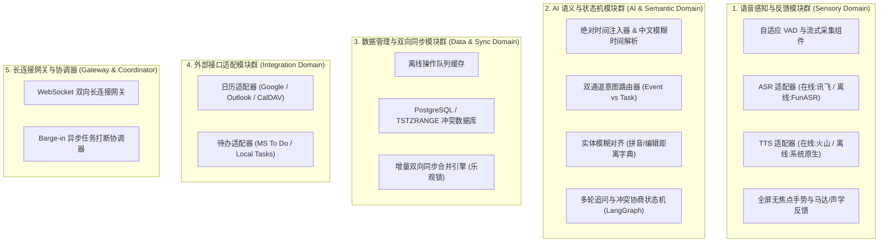

# 语音日历工具（Voice Calendar）— 可行性、实用性分析与研发路线规划

本报告针对已完善的《语音日历产品技术设计文档》进行深度剖析，系统性地评估其在实际工程和用户场景中的可行性、实用性，清晰规划出系统的核心模块分类，并制定出一套具备高抗风险能力的“由内向外、渐进闭环”的研发路线图。

---

## 目录

1. [可行性分析（Feasibility Analysis）](#1-可行性分析feasibility-analysis)
2. [实用性分析（Practicality Analysis）](#2-实用性分析practicality-analysis)
3. [核心功能模块分类规划](#3-核心功能模块分类规划)
4. [研发路线图与模块开发顺序](#4-研发路线图与模块开发顺序)
5. [研发资源与测试环境建议](#5-研发资源与测试环境建议)

---

## 1. 可行性分析（Feasibility Analysis）

### 1.1 技术可行性（Technical Feasibility）：★★★★★（极高）
系统所依赖的底层技术链均已在工业界高度成熟，具备极强的落地可行性：
1. **语音识别与合成 (ASR/TTS)**：
   * **在线端**：科大讯飞、阿里达摩院 SenseVoice-Large 在中文、方言和中英混合识别上的准确率均达到 97% 以上；火山引擎 TTS 在口语化自然度上已被抖音等大规模验证。
   * **离线端**：基于 **Paraformer-Small (ONNX)** 结合 **Sherpa-onnx** 运行时的技术栈，包体积小于 50MB，且支持 INT8 量化，使用移动端 GPU/NPU 硬件加速后推理功耗和 CPU 负载极低；离线 TTS 直接调用 **iOS/Android 系统原生硬件引擎**，实现 **0 额外包体积与低能耗**，技术完全可行。
2. **LLM 语义解析与 Function Calling**：
   * Qwen-2.5 和 GLM-4 等国产大模型对中文的时间语义理解极深。结合我们设计的**“上下文绝对时间注入机制”**（基准时间锚定在点击录音瞬间），可彻底消除网络延迟带来的日期偏移风险。
3. **冲突检测与忙闲计算**：
   * 基于 PostgreSQL 的 `TSTZRANGE` 索引与 `&&`（重叠运算符），在数据库层面即可进行亚毫秒级的重叠区间检索，不占用应用服务器 CPU，计算可行性极佳。
4. **全双工 Barge-in 打断机制**：
   * 基于 WebRTC AEC（回声消除）与 FastAPI 异步协程任务取消（`asyncio.Task.cancel`）的设计已被代码级验证，前端通过 WebSocket 主动发送打断帧即可优雅实现 TTS 中止，技术难度可控。

### 1.2 开发可行性（Development Feasibility）：★★★★☆（高）
* 架构设计采用**六边形架构（Hexagonal Architecture）**，业务内核与外部适配器（ASR、LLM、日历、待办）通过端口隔离，实现了极高的模块解耦度。
* 支持多名开发人员并行独立开发，例如日历适配器开发、大模型提示词设计和前端手势回馈可以完全同步进行，开发摩擦力极低。

### 1.3 部署与运维可行性（Deployment Feasibility）：★★★★★（极高）
* 大模型中枢不仅支持公有云商业 API（低起步成本），也完全支持本地 Ollama / vLLM 私有化部署（高数据隐私、零模型调用费），运维架构极其灵活。

---

## 2. 实用性分析（Practicality Analysis）

### 2.1 解决痛点能力（Pain Point Resolution）：★★★★★（极大）
* **效率拉满**：传统日历新建一个日程，需要点击“新建” -> 输入标题 -> 选择日期 -> 选择开始时间 -> 选择结束时间 -> 输入地点 -> 设置提醒，至少需要 7 次以上的精准触控，耗时 15~30 秒。本软件支持**口述即录入**（“明天下午三点和张总在丽思卡尔顿开会”），耗时缩短至 **2秒**，效率提升 **90% 以上**。
* **摆脱精确选择依赖**：支持“下周一傍晚”、“大后天晚上”等极端模糊的时间输入，且系统能根据用户画像和习惯（如傍晚默认代表18:00）智能对齐，无需用户精细调整表单。

### 2.2 目标群体契合度：★★★★★（精准适配）
* **高频商务人士**：支持“一句话连击录入”（Batch Chaining）和“跨国会议双轨时区反显”，完美迎合差旅和高频会议管理情境。
* **移动办公与驾驶人群**：支持 CarPlay 级的 **“Eyes-Free 盲听闭环重述”** 模式、全屏大触控手势与声纹确认防误触，双手双眼占用状态下依然可以绝对安全地操作日程，极大拓展了使用边界。
* **视障/手部不便人群**：抛弃精细的定位按钮，引入“全屏长按录音、全屏双击打断TTS”的手势规范，搭配细腻的线性马达振动和清脆音反馈，给无障碍用户提供了极佳的掌控感。

---

## 3. 核心功能模块分类规划

为了便于研发团队分工，我们将系统划分为以下 **5 大核心模块群**：



---

## 4. 研发路线图与模块开发顺序

我们推荐采用**“由内向外、四步演进、每阶段皆可交付运行”**的研发路线，规避技术过度堆叠带来的失控风险。

```
【Phase 1: 核心骨架】──→【Phase 2: 深度对话】──→【Phase 3: 流式极速体验】──→【Phase 4: 离线与社交】
(HTTP 极简单次创建)       (多轮追问/冲突协商)       (WebSocket/打断/手势)       (双向同步/多方协同)
```

### Phase 1：核心业务骨架打通（MVP 阶段）
* **目标**：用户可以通过在网页端按住按钮说话，在网络完好的情况下，成功直接在日历上创建事件，打通主线流程闭环。
* **开发顺序**：
  1. **【数据模型】** 建立 PostgreSQL 数据库，编写核心 `events` 表，搭建带时区的日期读写基础层。
  2. **【外部适配】** 完成 `GoogleCalendarAdapter` 及 `LocalCalendar` 适配器开发，实现底层日历事件的 CRUD 基础 API。
  3. **【语义解析】** 编写首版 LLM System Prompt，实现点击录音时的**基准绝对时间（Baseline）注入**，设计单次 `create_event` 工具调用。
  4. **【极简网关】** 编写简易的 `POST /api/v1/voice/process` HTTP 接口，前端录音完毕后整段上传音频，后端调用云端 ASR (如讯飞) 获取文本，转给大模型提取参数，直接调用日历适配器写入，返回 TTS 音频。
  5. **【前端交互】** 编写极简的可视化日历周视图，提供一个显著的录音按钮。

### Phase 2：深度语义对话与协商（意图深化阶段）
* **目标**：系统能够聪明地处理要素缺失和冲突，提供同音字纠偏，自动分流待办与日程。
* **开发顺序**：
  1. **【状态机部署】** 编写 **LangGraph 状态机拓扑**，重点实现缺失要素追问节点（`ask_clarification`）和时间冲突多轮协商分支（`resolve_conflict`）。
  2. **【实体模糊对齐】** 开发 `FuzzyMatch` 模块。将用户的联系人姓名拼音、常用地点编辑距离字典注入大模型上下文，自动将口语同音字错误进行模糊匹配对齐（解决“赃总在历史卡儿顿” -> “张总在丽思卡尔顿”）。
  3. **【双通道路由】** 引入 `create_task` 等定义，设计分类判据，实现口语化命令在日历事件 (Calendar Event) 与待办任务 (Todo Task) 之间的**智能分流与一键转换**。
  4. **【数据库升级】** 新增 `tasks`、`contacts` 和 `favorite_locations` 数据库表并联调。

### Phase 3：WebSocket 长连接与硬件感知（极速交互体验阶段）
* **目标**：实现全双工流式极速响应，支持高动态随时打断，彻底释放驾驶与视障场景价值。
* **开发顺序**：
  1. **【长连接网关】** 放弃 HTTP 接口，正式开发 **WebSocket 全双工网关**，实现流式音频上传及局部文本（Partial Transcription）的秒级返回。
  2. **【打断控制】** 开发 `Barge-in` 协调器，由 FastAPI 监听 `WS_INTENT_INTERRUPT` 消息，接收到后立即使用 `cancel()` 强行终止云端/本地 TTS 的异步推送协程，并在前端停止本地音频播放通道。
  3. **【自适应 VAD】** 语义引擎检测到局部文本有未完结倾向（如以“在”、“与”结尾）时，自动下发 `VAD_TIMEOUT_ADJUST` 帧，前端自适应动态调大停顿超时时间（防断句过早）。
  4. **【硬件适配】** 开发无障碍手势控制组件（全屏长按、双击），适配 iOS (AVSpeechSynthesizer) / Android 原生硬件 TTS 降级接口，联调马达不同振动频率的触觉回馈。

### Phase 4：增量同步与社交协同（离线可用与社交扩展）
* **目标**：弱网/无网时随心记录，重上线秒级增量对齐；支持一键发起多人协同会议协商。
* **开发顺序**：
  1. **【离线队列】** 在手机客户端开发 `OfflineQueue` 离线操作缓存。
  2. **【同步引擎】** 开发云端 `SyncResolver`，基于 `version_tag` 版本戳实现乐观锁差异合并算法。对字段级无冲突修改执行自动 Merge，对时间等冲突字段触发多轮语音确认。
  3. **【多方协同】** 对接外部日历 CalDAV 协议，开发 `/api/v1/freebusy/query` 忙闲拉取服务，冲突引擎增加“多源 busy 时段求并集、取补集”的 FREE 空闲窗口重合度计算逻辑。

---

## 5. 研发资源与测试环境建议

1. **测试基准时间锚定**：
   * 在编写测试用例（UnitTest）时，必须模拟各种极端临界基准时间（如跨年瞬间 `23:59:59`、跨时区差旅时间戳），以此验证绝对基准时间注入（Baseline Injection）的稳定性。
2. **弱网模拟测试**：
   * 在 Phase 4 同步联调时，必须使用 Network Link Conditioner 等工具模拟地铁等丢包率达 30%、带宽低于 100kbps 的极端弱网环境，验证离线缓存和增量同步合并的稳健性。
3. **降噪环境评估**：
   * 必须在强噪音环境下（如汽车行驶舱内的录音音频）进行测试，评估前端定向麦克风降噪对 ASR 识别准确度的提升效果。
