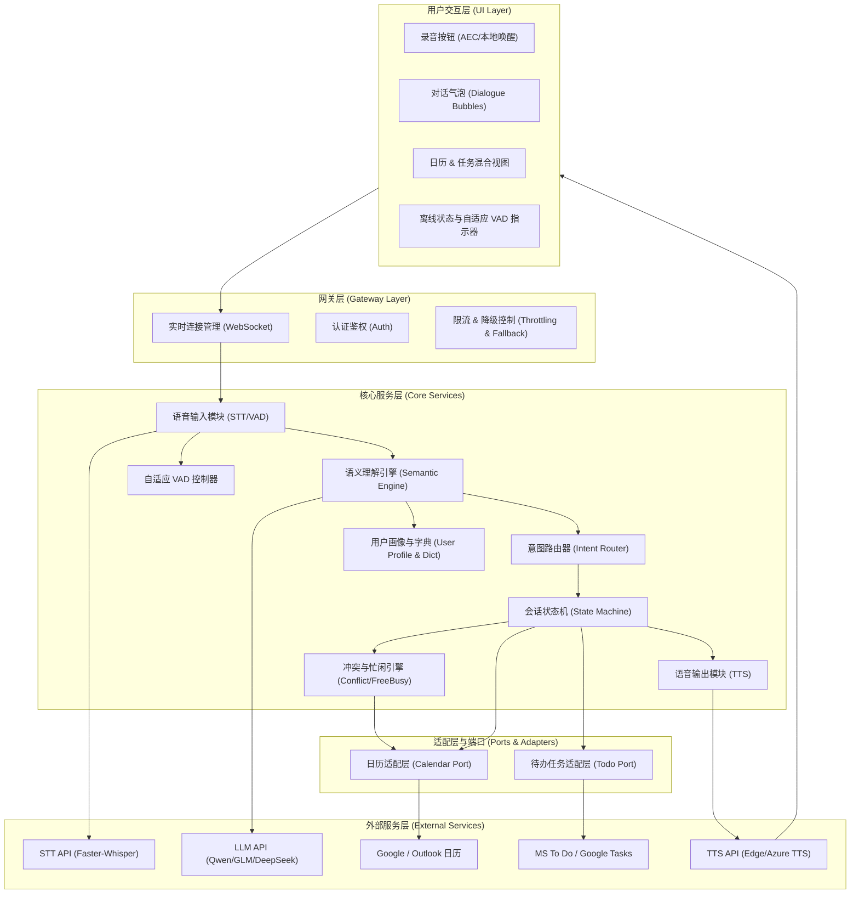

# 语音日历工具（Voice Calendar）— 产品设计文档

> **版本**：v1.1
> **日期**：2026-05-29
> **定位**：以语音交互为核心的智能日历管理工具，帮助用户通过自然语言高效管理日程

---

## 目录

1. [产品概述](#1-产品概述)
2. [场景分析与解决方案](#2-场景分析与解决方案)
   - [场景一：时间异构与极端模糊时间](#21-场景一时间异构与极端模糊时间)
   - [场景二：语音识别同音字与噪音污染](#22-场景二语音识别同音字与噪音污染)
   - [场景三：关键要素缺失](#23-场景三关键要素缺失)
   - [场景四：日程时间冲突与时区重叠](#24-场景四日程时间冲突与时区重叠)
   - [场景五：多轮修改与意图漂移](#25-场景五多轮修改与意图漂移)
   - [场景六：周期性/重复日程的复杂表达](#26-场景六周期性重复日程的复杂表达)
   - [场景七：多日历管理与权限隔离](#27-场景七多日历管理与权限隔离)
   - [场景八：离线与弱网环境下的降级体验](#28-场景八离线与弱网环境下的降级体验)
   - [场景九：多方会议协同与空闲时间查询](#29-场景九多方会议协同与空闲时间查询multi-party-coordination--freebusy-lookup)
   - [场景十：语音识别断句过早与用户打断处理](#210-场景十语音识别断句过早premature-vad-endpointing与用户打断处理)
   - [场景十一：日历事件与待办任务的混淆处理](#211-场景十一日历事件event与待办任务tasktodo的混淆处理)
   - [场景十二：离线数据双向同步与冲突合并](#212-场景十二离线数据双向同步与冲突合并bi-directional-offline-sync-conflict-resolution)
   - [场景十三：中文口语化时间歧义消解](#213-场景十三中文口语化时间歧义消解chinese-time-ambiguity-resolution)
3. [系统架构设计](#3-系统架构设计)
   - [3.1 总体架构](#31-总体架构)
   - [3.2 核心模块解耦](#32-核心模块解耦)
   - [3.3 模块依赖关系](#33-模块依赖关系)
4. [核心模块详细设计](#4-核心模块详细设计)
   - [4.1 语音输入模块（Voice Input Module）](#41-语音输入模块voice-input-module)
   - [4.2 语义理解引擎（Semantic Engine）](#42-语义理解引擎semantic-engine)
   - [4.3 意图路由与状态机（Intent Router & State Machine）](#43-意图路由与状态机intent-router--state-machine)
   - [4.4 日历服务适配层（Calendar Service Adapter）](#44-日历服务适配层calendar-service-adapter)
   - [4.5 冲突检测引擎（Conflict Detection Engine）](#45-冲突检测引擎conflict-detection-engine)
   - [4.6 语音输出模块（Voice Output Module）](#46-语音输出模块voice-output-module)
   - [4.7 用户画像与字典服务（User Profile & Dictionary Service）](#47-用户画像与字典服务user-profile--dictionary-service)
   - [4.8 待办任务适配层（Todo Service Adapter）](#48-待办任务适配层todo-service-adapter)
   - [4.9 双向同步与冲突解决引擎（Sync & Conflict Resolver）](#49-双向同步与冲突解决引擎sync--conflict-resolver)
5. [数据模型设计](#5-数据模型设计)
6. [核心接口定义（API）](#6-核心接口定义api)
   - [6.1 语音交互接口](#61-语音交互接口)
   - [6.2 事件管理接口](#62-事件管理接口)
   - [6.3 冲突检测接口](#63-冲突检测接口)
   - [6.4 用户字典接口](#64-用户字典接口)
   - [6.5 待办任务管理接口 (REST API)](#65-待办任务管理接口-rest-api支持场景十一)
   - [6.6 增量双向同步接口 (Sync API)](#66-增量双向同步接口-sync-api支持场景十二)
   - [6.7 多方忙闲与协同接口 (FreeBusy & Coordination API)](#67-多方忙闲与协同接口-freebusy--coordination-api支持场景九)
7. [交互流程设计](#7-交互流程设计)
   - [7.1 完整创建流程（无冲突）](#71-完整创建流程无冲突)
   - [7.2 要素缺失 + 追问流程](#72-要素缺失--追问流程)
   - [7.3 冲突处理流程](#73-冲突处理流程)
   - [7.4 多方会议协同忙闲协商流程](#74-多方会议协同忙闲协商流程-场景九)
   - [7.5 自适应 VAD 与打断 (Barge-in) 交互流程](#75-自适应-vad-与打断-barge-in-交互流程-场景十)
   - [7.6 离线数据同步冲突合并流程](#76-离线数据同步冲突合并流程-场景十二)
   - [7.7 目标人群适配交互专篇](#77-目标人群适配交互专篇target-audience-interaction-adaptations)
8. [Function Calling 设计](#8-function-calling-设计)
   - [8.1 函数定义](#81-函数定义)
   - [8.2 Tool Chaining 执行流程](#82-tool-chaining-执行流程)
9. [技术选型（已确定）](#9-技术选型已确定)
   - [9.1 前端交互层](#91-前端交互层client-layer)
   - [9.2 后端核心与网关层](#92-后端核心与网关层backend--gateway-layer)
   - [9.3 AI 中枢与语音处理层](#93-ai-中枢与语音处理层ai--speech-layer)
   - [9.4 数据存储与状态管理层](#94-数据存储与状态管理层storage--state-layer)
   - [9.5 技术架构全景图](#95-技术架构全景图)
   - [9.6 PostgreSQL 冲突检测 SQL 示例](#96-postgresql-冲突检测-sql-示例)
   - [9.7 Redis 会话状态管理示例](#97-redis-会话状态管理示例)
   - [9.8 LangGraph 状态机示例](#98-langgraph-状态机示例)
   - [9.9 FastAPI WebSocket 全双工 Barge-in 代码示例](#99-fastapi-websocket-全双工-barge-in-代码示例)
10. [Demo 演示脚本](#10-demo-演示脚本)
11. [风险与边界](#11-风险与边界)
12. [后续演进路线](#12-后续演进路线)

---

## 1. 产品概述

### 1.1 产品愿景

让日历管理回归"说话"的本质——用户只需开口，系统自动理解、纠错、补全、创建，彻底消除传统日历应用中繁琐的表单填写和手动操作。

### 1.2 核心价值

| 维度 | 传统日历 | 语音日历 |
|------|---------|---------|
| 输入方式 | 手动填写表单 | 自然语言语音 |
| 时间表达 | 必须精确选择日期时间 | 支持"明天下午"、"下周一"等模糊表达 |
| 纠错能力 | 无 | 自动纠偏同音字、补全缺失信息 |
| 冲突处理 | 手动检查 | 自动检测并智能协商 |
| 多平台 | 各平台独立操作 | 统一语音入口，多日历同步 |

### 1.3 目标用户

- 高频商务人士（日程密集，需要快速录入）
- 移动办公人群（开车/走路时无法手动操作）
- 视障/手部不便用户（语音为主要交互方式）

---

## 2. 场景分析与解决方案

### 2.1 场景一：时间异构与极端模糊时间

#### 问题描述

用户使用极其宽泛的相对时间（如"下个月底"、"大后天晚上"），系统难以准确解析。临界点歧义问题：在 23:59:30 秒时说"明天早上面试"，因网络延迟导致大模型在 0:00:05 收到请求，"明天"变成了"今天"。

#### 边界定义

- 系统必须具备**绝对基准时间注入**能力
- 必须支持 **RFC 5545 / ISO 8601** 标准时间格式输出
- 相对时间解析的误差范围 ≤ 1 秒

#### 解决方案

**① 上下文时钟注入（Baseline Injecting）**

前端在用户点击录音的瞬间，获取本地精确时间戳（如 `2026-05-29 00:17:55`），并在发送给大模型时，通过系统提示词强制注入：

```
当前绝对时间是 2026年5月29日 星期五 00:17:55，请基于此基准计算所有相对时间。
```

> **关键点**：时间戳取自**录音开始时刻**而非请求发送时刻，消除网络延迟带来的日期偏移。

**② 双层解析机制**

利用 LLM 的 Function Calling，限制其必须输出标准的 ISO 8601 时间格式（如 `2026-06-01T14:30:00`）。如果遇到复杂的周期性日程（如"隔周周三"），大模型需输出符合 iCalendar 标准的 RRULE：

```
RRULE:FREQ=WEEKLY;INTERVAL=2;BYDAY=WE
```

**③ 时间置信度评分**

对模糊时间表达输出置信度分数（0~1），低于阈值（如 0.7）时触发确认追问：

| 用户表达 | 解析结果 | 置信度 | 系统行为 |
|---------|---------|--------|---------|
| "明天下午3点" | 2026-05-30T15:00:00 | 0.98 | 直接创建 |
| "下个月底" | 2026-06-30T23:59:59 | 0.65 | 追问确认 |
| "大后天" | 2026-06-01T00:00:00 | 0.92 | 直接创建 |
| "过两天" | 无法确定 | 0.40 | 追问确认 |

---

### 2.2 场景二：语音识别同音字与噪音污染

#### 问题描述

STT（语音转文本）将人名或地点识别错。例如：把"和张总在丽思卡尔顿吃饭"听成"和赃总在历史卡儿顿吃饭"。口语化废话干扰（如"呃…那个…你帮我记一下吧，应该是…"）。

#### 边界定义

- **不允许**直接将 STT 的原始文本（Raw Text）存入日历数据库
- 必须经过语义清洗与实体校验
- 实体纠错准确率目标 ≥ 90%

#### 解决方案

**① LLM 语义纠偏与降噪层**

不让大模型直接做业务处理，而是先做一层"意图提取与纠错"。Prompt 中加入纠错范例：

```
你是一个语音转文本的后处理引擎。请从以下原始语音文本中提取结构化信息，
纠正同音字错误，去除口语化废话。

纠错范例：
- 原文："和赃总在历史卡儿顿吃饭" → 纠正后："和张总在丽思卡尔顿吃饭"
- 原文："呃那个你帮我记一下明天开会" → 纠正后："明天开会"
```

**② 业务字典关联（Address Book / RAG）**

允许工具读取用户的联系人列表或历史常用地点。大模型在处理时，比对"赃总"和联系人中的"张总"，自动完成模糊对齐与实体修复。

```
用户联系人列表：[张总、李明、王芳...]
用户常用地点：[丽思卡尔顿、国贸大厦、星巴克CBD店...]
```

**处理流程**：
```
STT原始文本 → 降噪层（去除废话）→ 实体提取 → 字典匹配（模糊对齐）→ 纠偏后文本 → 业务处理
```

---

### 2.3 场景三：关键要素缺失

#### 问题描述

用户只说了事件没说时间（如"提醒我交房租"），或只说了时间没说做什么（如"明天下午两点帮我留个空"）。

#### 边界定义

- 完整的日历事件**必须包含** `title` 和 `start_time`
- 任意一项缺失，**不能强行创建**，也不能直接报错返回
- 追问轮次上限为 3 轮，超过则降级为手动补全

#### 解决方案

**① 基于会话状态机（Session State）的智能追问**

定义一个 JSON Schema 作为函数的参数。当大模型发现必要参数未补全时，不调用 `create_event` 函数，而是触发 `ask_clarification`（澄清追问）函数。

```json
{
  "function": "ask_clarification",
  "arguments": {
    "missing_fields": ["start_time"],
    "prompt": "好的，已记录「交房租」。请问您希望设置在什么时间提醒您？"
  }
}
```

**② 对话上下文继承**

```
用户："提醒我明天开会。"          → 系统：时间=明天，事件=开会。追问："请问几点开始？"
用户："下午两点。"                → 系统合并：时间=明天14:00，事件=开会。创建成功。
```

**③ 状态机流转图**

```
[空闲态] → 收到语音 → [意图解析态]
                          ↓
                    参数完整？
                   /          \
                 是            否
                 ↓              ↓
           [执行态]      [追问态] ←──→ 用户回复
                 ↓                          ↓
           [确认态] ←────────────── 参数补全
                 ↓
           [完成态]
```

---

### 2.4 场景四：日程时间冲突与时区重叠

#### 问题描述

用户创建日程的时间段已存在另一个重要会议。跨时区差旅场景下（如从北京飞往伦敦），口头说的"早上9点"在日历反显时出现时差错乱。

#### 边界定义

- 写入数据库前，**必须进行前置校验**（Pre-flight Check）
- 时区信息不可丢失，所有时间必须携带 `timezone` 字段
- 冲突检测的时间粒度为分钟级

#### 解决方案

**① 原子化函数组合（Tool Chaining）**

当用户说"帮我定个明天下午2点的会"时，大模型的执行顺序不是直接创建，而是：

```
Step 1: query_calendar(start=明天14:00, end=明天15:00)
Step 2: 判断返回结果
  → 无冲突 → create_event(...)
  → 有冲突 → 进入冲突话术分支
```

冲突话术示例：
```
"您明天下午2点已经有「产品同步会」了，需要帮您覆盖，还是改到下午3点？"
```

**② 时区锁（TZ-Locking）**

系统在前端捕获设备当前的本地时区（如 `Asia/Shanghai`），在创建事件时统一带上时区偏移量：

```json
{
  "title": "面试",
  "start_time": "2026-06-01T09:00:00+08:00",
  "timezone": "Asia/Shanghai"
}
```

防止用户在差旅时日历时间轴发生漂移。

---

### 2.5 场景五：多轮修改与意图漂移

#### 问题描述

用户在创建事件后想要修改（"把刚才那个会议改到3点"），或者连续对话中意图发生漂移（先说开会，又说"算了不开会了，改成聚餐"）。系统需要准确识别"刚才那个"指代的是哪个事件，并正确执行修改或取消操作。

#### 边界定义

- 修改/删除操作必须**明确锁定目标事件**，不允许模糊匹配后静默执行
- 指代消解（Coreference Resolution）的准确率目标 ≥ 85%
- 支持对最近 N 条（默认 5 条）事件的指代引用

#### 解决方案

**① 会话上下文事件缓存（Event Context Buffer）**

在会话期间维护一个事件缓存队列，记录用户在本次会话中提及或操作过的所有事件：

```json
{
  "session_id": "sess_abc123",
  "event_buffer": [
    { "event_id": "evt_001", "title": "产品评审会", "start_time": "2026-05-30T14:00:00", "mentioned_at": "turn_3" },
    { "event_id": "evt_002", "title": "和客户吃饭", "start_time": "2026-05-31T18:00:00", "mentioned_at": "turn_5" }
  ]
}
```

**② 指代消解策略**

当用户说"把刚才那个改到3点"时，系统按以下优先级消解指代：

1. **最近提及事件**：`event_buffer` 中 `mentioned_at` 最大的事件
2. **时间近邻匹配**：用户提到的时间附近的事件
3. **标题模糊匹配**：关键词与事件标题的相似度

**③ 意图漂移检测**

通过维护一个"待确认操作栈"，当检测到用户意图发生反转时，弹出确认：

```
用户："帮我定明天下午两点开会"     → 栈：[create_event(开会, 明天14:00)]
用户："算了，改成聚餐吧"           → 检测到漂移 → 确认："是要把「开会」改成「聚餐」，还是另外新建一个「聚餐」？"
```

---

### 2.6 场景六：周期性/重复日程的复杂表达

#### 问题描述

用户使用复杂的自然语言描述重复日程，如"每个工作日上午9点站会"、"隔周周三下午团建"、"每个月最后一个周五发工资提醒"、"从下周一到下下周五每天提醒我喝水"。

#### 边界定义

- 必须支持 **RFC 5545 RRULE** 标准输出
- 必须正确处理"工作日"、"隔周"、"每月最后一个"等复合规则
- 对于自然语言无法精确表达的规则，必须追问确认

#### 解决方案

**① RRULE 模板映射表**

预定义常见周期表达与 RRULE 的映射关系：

| 用户表达 | RRULE |
|---------|-------|
| "每天" | `FREQ=DAILY` |
| "每个工作日" | `FREQ=DAILY;BYDAY=MO,TU,WE,TH,FR` |
| "每周一" | `FREQ=WEEKLY;BYDAY=MO` |
| "隔周周三" | `FREQ=WEEKLY;INTERVAL=2;BYDAY=WE` |
| "每月第一个周一" | `FREQ=MONTHLY;BYDAY=1MO` |
| "每月最后一个周五" | `FREQ=MONTHLY;BYDAY=-1FR` |
| "每季度" | `FREQ=MONTHLY;INTERVAL=3` |

**② LLM + 规则引擎混合解析**

```
用户语音 → LLM提取周期意图 → 匹配RRULE模板
                              ↓ 匹配成功
                         直接生成RRULE
                              ↓ 匹配失败
                         LLM直接生成RRULE（带置信度）
                              ↓ 置信度低
                         追问确认
```

**③ 日期范围限定**

对于有限期的重复日程（如"从下周一到下下周五每天"），生成 `RRULE` + `UNTIL` 或 `COUNT`：

```
FREQ=DAILY;UNTIL=20260613T235959
// 或
FREQ=DAILY;COUNT=10
```

---

### 2.7 场景七：多日历管理与权限隔离

#### 问题描述

用户同时使用多个日历（工作日历、个人日历、家庭共享日历），语音创建事件时需要指定放到哪个日历。此外，在家庭共享日历中，不同成员的权限不同（有的只能查看，有的可以编辑）。

#### 边界定义

- 默认日历必须可配置（大多数事件落入默认日历）
- 跨日历操作必须经过权限校验
- 共享日历的变更需要通知相关成员

#### 解决方案

**① 默认日历 + 语音别名**

用户可以为每个日历设置语音别名：

```json
{
  "calendars": [
    { "id": "cal_work", "name": "工作", "alias": ["工作", "公司", "上班"], "is_default": true },
    { "id": "cal_personal", "name": "个人", "alias": ["个人", "私事", "生活"] },
    { "id": "cal_family", "name": "家庭", "alias": ["家庭", "家里", "家人"] }
  ]
}
```

当用户说"明天下午3点在工作日历加个会议"或"帮我记一下周末家庭聚餐"时，系统自动匹配目标日历。

**② 权限矩阵**

| 操作 | 拥有者 | 编辑者 | 查看者 |
|------|--------|--------|--------|
| 创建事件 | ✅ | ✅ | ❌ |
| 修改事件 | ✅ | ✅ | ❌ |
| 删除事件 | ✅ | 仅自己的 | ❌ |
| 查看事件 | ✅ | ✅ | ✅ |

**③ 语音指令中的日历切换**

```
用户："把那个会议移到个人日历"
系统："已将「产品评审会」从工作日历移动到个人日历。"
```

---

### 2.8 场景八：离线与弱网环境下的降级体验

#### 问题描述

用户在地铁、电梯等弱网或无网环境下使用语音日历，无法连接到大模型 API 或日历服务。如果直接报错，用户体验极差。

#### 边界定义

- 离线模式下必须保留**基础事件创建能力**
- 离线创建的事件在恢复网络后**自动同步**
- 降级体验的功能损失必须对用户透明（明确告知当前为离线模式）

#### 解决方案

**① 三级降级策略**

```
Level 1（在线完整模式）：
  STT(云端) → LLM(云端) → 日历服务(云端) → TTS(云端)
  全功能可用

Level 2（弱网模式 - 仅LLM降级）：
  STT(云端) → 本地规则引擎(轻量解析) → 本地缓存 → 恢复后同步
  支持简单日程创建，不支持复杂语义理解

Level 3（离线模式）：
  STT(本地/浏览器Web Speech API) → 本地缓存(文本+时间戳) → 恢复后由LLM补全解析
  仅记录原始语音文本，恢复网络后自动处理
```

**② 离线队列与自动同步**

```json
{
  "offline_queue": [
    {
      "id": "off_001",
      "raw_audio_path": "/offline/voice_001.webm",
      "raw_text": "明天下午三点开会",
      "captured_at": "2026-05-29T15:30:00",
      "device_timezone": "Asia/Shanghai",
      "sync_status": "pending"
    }
  ]
}
```

**③ 用户感知设计**

```
[离线模式]
系统："当前网络不可用，已进入离线模式。您说的话我会先记下来，等网络恢复后自动处理。"
用户："明天下午三点开会"
系统："好的，已记录。网络恢复后会自动帮您创建。"
```

---

### 2.9 场景九：多方会议协同与空闲时间查询（Multi-party Coordination & FreeBusy Lookup）

#### 问题描述

用户希望在语音中发起与他人的联合会议，例如“帮我找个下周一我和李强、王芳都有空的一小时，安排项目评审会”。此时，系统必须解决：
1. 共享/协作者忙闲数据（Free/Busy）的获取与隐私过滤。
2. 多个时间段冲突的计算，并找出所有人共同的空闲窗口。
3. 交互式协商过程：当没有完美重合时间或有部分冲突时的退而求其次。

#### 边界定义

- 必须基于标准的 **RFC 4791 (CalDAV)** / **Google FreeBusy API** 过滤敏感事件细节，仅返回 `BUSY` 时间段，保护他人隐私。
- 会议发起者必须对目标人员的 FreeBusy 数据有读取权限。
- 若 3 轮内无法通过语音达成一致，自动生成一份包含可选空闲时段的链接供用户转发确认。

#### 解决方案

**① 多源 FreeBusy 聚合与重合度计算**

- 语义引擎提取参与者列表（如“李强”、“王芳”），从字典服务对齐其 Email 账号。
- 后端调用 `query_freebusy(emails, time_range)` 接口，获取各自的 `BUSY` 忙闲区间（仅包含起止时间，无内容详情）。
- 冲突检测引擎在内存中对所有人的 `BUSY` 区间求并集（Union），再取时间轴的补集，计算出重合的 `FREE` 空闲窗口。

**② 多轮协商与智能备选推荐**

- 若存在完美重叠的空闲时间段，大模型优先推荐：“下周一下午2点到3点大家都有空，要定在这个时间吗？”。
- 若无完美交集，自动松弛约束条件（如：排除次要参与者，或缩短会议时长，或寻找局部冲突最小的时段），并主动发起多轮协商：“下周一李强和您都有空，但王芳 3 点有会，可以改在下午 4 点吗？或者缩短为半小时？”。

---

### 2.10 场景十：语音识别断句过早（Premature VAD Endpointing）与用户打断处理

#### 问题描述

1. **断句过早**：口语交互中，用户在思考时会产生自然停顿（例如：“帮我记一下……[停顿2.5秒]……明天和张总吃晚饭”）。如果 WebRTC VAD 强行使用默认的 1.5s 停顿静音阈值，会导致音频提早切断，LLM 解析出残缺的意图。
2. **中途打断**：系统在用 TTS 播报长文本时，用户发现信息有误，想立即打断并修正（例如系统正播报：“已为您创建明天下午2点的会议...”，用户说：“不对！是下午3点！”）。

#### 边界定义

- 自适应 VAD 延迟最大不超过 5 秒，防止响应延迟过长。
- 打断检测（Barge-in）响应延迟必须低于 300 毫秒，且必须在前端完成音频通道关闭以避免扬声器自激回声。

#### 解决方案

**① 上下文感知的自适应 VAD（Context-Aware Adaptive VAD）**

- 前端在双向 WebSocket 通道下，处于**意图首发状态（Idle -> Parsing）**时，检测实时 STT 返回的局部文本（Partial Transcription）。
- 如果 partial text 结尾是介词、助词或连词（如“在”、“与”、“时间是”、“提醒我……”等未完结短语），前端自适应 VAD 控制器动态将 `silence_timeout` 从 1.5 秒提升至 4.0 秒，给用户留出充分思考时间。

**② 全双工 Barge-in（主动打断）与回声消除（AEC）**

- 前端在播放 TTS 的同时保持麦克风开启，通过 WebRTC AEC 消除扬声器播放的系统播报声。
- 在前端部署轻量级本地唤醒与断句模块，一旦检测到持续的用户有效语音（如“等一下”、“不对”或任何以高能量输入的语音），立即强行**中止本地音频播放**并向后端发送打断信号 `WS_INTENT_INTERRUPT`，重置会话至当前编辑草稿状态，继承已确认的字段。

---

### 2.11 场景十一：日历事件（Event）与待办任务（Task/Todo）的混淆处理

#### 问题描述

日历事件（Calendar Event）用于描述“占坑式”的时间块（有明确的起止时间且与其他日程互斥），而待办任务（Task/Todo）则表示“无固定时长、需完成的目标”（可能带截止日期，也可能没有，如“提醒我交电话费”、“记得去买牛奶”）。用户在口头输入时两者是混淆的，系统需要精准分流并写入对应模块。

#### 边界定义

- 凡是没有说起止时长，且动词带有“记得”、“去”、“完成”等非会议/非聚集特征的，默认判定为 Task。
- 待办任务不能占用日历的时钟冲突检测，但可以作为“全天事件”或“任务侧边栏”展示。

#### 解决方案

**① 双通道语义分类器（Dual-Channel Intent Classifier）**

- 在 LLM Function Calling 中引入 `create_task` 和 `create_event` 两个候选工具。
- 提示词中明确分类判据：
  - `create_event` 判据：包含明确时长、与人开会、聚集性活动（如开会、吃饭、面试、看电影）。
  - `create_task` 判据：单人执行的、无具体耗时的事务性工作（如“买东西”、“交费”、“还书”），或者包含“记得”、“别忘了”等纯提醒性质的话术。

**② 动态类型转换支持**

- 允许用户在对话中对类型进行一键转换：
  - 用户：“把刚才那个‘交房租’改成明天下午两点到三点的会议。”
  - 意图路由器检测到漂移，调用 `delete_task` 销毁刚创建的任务，并调用 `create_event` 创建一个时间块为 14:00~15:00 的日历日程。

---

### 2.12 场景十二：离线数据双向同步与冲突合并（Bi-directional Offline Sync Conflict Resolution）

#### 问题描述

在无网或弱网环境下，用户使用离线队列记录或修改了日程。在此期间，另一个终端或共享日历的协作者在云端对相同的日程进行了修改（例如，离线修改：“把明天会议移到下午3点”；云端修改：“把明天会议改到下午4点”并修改了标题）。当离线设备重新上线时，系统会发生同步冲突。

#### 边界定义

- 所有日历与待办实体必须包含 `version_tag`（由 UUID + 修改时间戳生成的版本令牌）。
- 离线操作队列执行采用“乐观锁+交互协商”双轨制。

#### 解决方案

**① 版本戳与增量同步队列**

- 离线写入的实体包含本地生成的临时版本戳 `local_v1`。
- 重新上线时，客户端向后端发送同步包 `/api/v1/sync`，携带离线操作历史和每个受影响日程的原始 `version_tag`。

**② 冲突合并策略（Merge Strategy）**

- **无冲突（Fast-Forward）**：若云端 `version_tag` 与客户端离线前的原始 `version_tag` 一致，且没有被其他客户端更新，直接执行客户端修改，并将云端版本戳更新为 `v2`。
- **有冲突（Version Conflict）**：若云端已是 `v3`，表示云端已被修改。系统比对修改字段：
  - **字段无交集**（例如客户端改了地点，云端改了参与人）：自动合并，自动生成合并后的版本并异步通知用户。
  - **字段有交集**（如均修改了开始时间）：触发**交互式确认**。系统播报：“在您离线期间，「产品同步会」已被他人修改为下午 4 点，您本地修改为下午 3 点。已为您保留云端的 4 点会议，并将您本地修改的 3 点会议另存为‘[冲突备用]产品同步会’，您需要现在调整吗？”。

---

### 2.13 场景十三：中文口语化时间歧义消解（Chinese Time Ambiguity Resolution）

#### 问题描述

中文口语时间表达高度依赖语境 and 文化习惯。
1. **周日表述歧义**：当今天是周日 2026-05-31 时，用户说“下周一开会”：
   - 狭义理解：距离最近的下一个周一，即“明天” 06-01。
   - 广义理解：下个星期（下一周）的周一，即 06-08。
2. **周末表述歧义**：当今天是周六上午时，用户说“这周末下午去钓鱼”，一般指“今天”或“明天”。但如果是在周日上午说，则是指“今天”还是“下周六/日”？
3. **模糊时间段重叠**：用户说“傍晚开会”，不同人对“傍晚”的定义不同（17:00? 18:00? 19:00?）。

#### 边界定义

- 系统判定歧义置信度低于 0.8 时，**绝不能静默创建**，必须触发语义确认。
- 提供基于当前时间戳及星期几的强硬规则校正器。

#### 解决方案

**① 规则引擎与概率混合解析（Hybrid Temporal Resolver）**

- 语义引擎对易混淆时间词汇建立基于当前是星期几（Day of Week）的权重矩阵：
  - 当基准时间是 **周日** 时，解析“下周一”：
    - `2026-06-01` (明天) 概率权重 40%
    - `2026-06-08` (下下周一) 概率权重 60%
  - 此时置信度为 0.6，不足 0.8，触发**主动带选项澄清**。

**② 带推荐的主动澄清与偏好拟合**

- 系统生成智能播报：“好的，帮您定「开会」。请问您是指明天的 6月1号，还是下周一的 6月8号？”
- 同样地，对于“傍晚”等词，结合用户历史画像（如用户通常在 18:00 安排傍晚会议）进行预测，并在确认时说：“帮您定在傍晚 6点 可以吗？”。

---

### 2.14 场景十四：外部时效性实践活动联网检索与一键录入 (Web Search & Structured Activity Injection)

#### 问题描述

用户经常会有涉及外部实时/未来时效性实践活动（如漫展时间、车展、音乐节、体育赛事、天气排期等）的日程记录需求。例如：“帮我搜一下下周上海有什么动漫展，并加到日程里”或“查查杭州最近的活动”。
这类活动信息具有强时效性且不在日历本地数据库中。以往用户需要先打开浏览器搜索，查到具体的时间和场馆，再手动复制粘贴创建日程，流程碎片化，效率低下。

#### 边界定义

- 语义分析引擎 M3 嗅探用户输入，若包含“搜/查/实践/活动/漫展/音乐节”等显著联网意图，控制权转至 M9。
- M9 调用 Web Search Adapter 获取网页文本切片，通过大语言模型提炼出标准的日程字段（标题、时间、场馆、简述、原网页链接）。
- 在卡片中结构化反显检索出的活动，用户可以通过“一键加入日历”快捷完成高精度物理日程写入。

#### 解决方案

**① 联网检索智能体（Web Search Agent M9）集成**
- 通过六边形架构的 `IWebSearchPort` 屏蔽具体搜索适配器细节，默认集成 Tavily / Google Search，返回最新的页面切片。
- LLM 配合基准时间将搜索结果中的模糊口语化时间（如“本周末”）转换为标准 ISO 8601 起止时间。

**② 交互卡片与一键录入**
- 前端向 M9 推送流式请求状态，渲染带扫描光效的 Loading 动画与大模型 Parsing 动画，确保用户获得流畅的高反馈交互体验。
- 解析完成后列表展示结构化日程，按钮支持乐观更新状态，一键注入 Pinia 日历 Store 并伴随 TTS 语音重述。

---

## 3. 系统架构设计

### 3.1 总体架构



### 3.2 核心模块解耦

系统采用**六边形架构（Hexagonal Architecture / Ports & Adapters）**，核心业务逻辑不依赖任何外部服务实现，通过端口（接口）与外部适配器解耦。

```
                    ┌───────────────────────────────────────┐
                    │              Core Domain              │
                    │        (纯业务逻辑，无外部依赖)       │
                    │                                       │
                    │  - 意图路由及状态机                     │
                    │  - 冲突检测与多方忙闲计算               │
                    │  - 离线双向同步合并算法                 │
                    │  - 中文时间自适应歧义解析               │
                    └──────────┬────────────────────────────┘
                               │
         ┌─────────────────────┼──────────────────────┬──────────────────────┐
         │                     │                      │                      │
   ┌─────▼─────┐         ┌─────▼─────┐          ┌─────▼─────┐          ┌─────▼─────┐
   │ Port: STT │         │ Port: LLM │          │Port:Calendar│        │ Port: Todo│
   │ (输入端口)│         │ (AI端口)  │          │ (日历端口)│        │ (待办端口)│
   └─────┬─────┘         └─────┬─────┘          └─────┬─────┘          └─────┬─────┘
         │                     │                      │                      │
   ┌─────▼─────┐         ┌─────▼─────┐          ┌─────▼─────┐          ┌─────▼─────┐
   │ Adapter:  │         │ Adapter:  │          │ Adapter:  │          │ Adapter:  │
   │ Whisper / │         │ OpenAI/   │          │ Google/   │          │ MS To Do  │
   │ Web Speech│         │ Qwen/GLM  │          │ Outlook/  │          │ GoogleTask│
   │ 本地 VAD  │         │ 本地 Ollama│          │ CalDAV    │          │ 本地 Task │
   └───────────┘         └───────────┘          └───────────┘          └───────────┘
```

### 3.3 模块依赖关系

```
VoiceInput ──→ SemanticEngine ──→ IntentRouter ──→ StateMachine
                    │                                   │
                    ▼                                   ├───────────────┐
              UserDictionary                            ▼               ▼
                    │                            CalendarAdapter   TodoAdapter
                    ▼                                   │               │
              ConflictEngine                    ExternalCalendar    ExternalTodo
                    │                                   │               │
                    └─────────────→ SyncResolver ◄──────┴───────────────┘
                                         │
                                         ▼
                                    VoiceOutput
```

**依赖规则**：
- `SemanticEngine` 依赖 `UserDictionary`（实体校验），但不依赖 `CalendarAdapter`
- `IntentRouter` 依赖 `StateMachine`，但不直接依赖日历服务
- `ConflictEngine` 仅被 `CalendarAdapter` 在写入前调用
- `VoiceOutput` 接收执行结果，生成语音反馈，不参与业务决策

---

## 4. 核心模块详细设计

### 4.1 语音输入模块（Voice Input Module）

**职责**：采集用户语音，转换为文本，附加元数据。

**核心接口**：

```typescript
interface IVoiceInput {
  // 开始实时流式录音，并通过 WebSocket 发送数据片
  startStreaming(session: RecordingSession, onData: (chunk: AudioChunk) => void): Promise<void>;

  // 停止流式录音
  stopStreaming(): Promise<void>;

  // 动态自适应调整 VAD 的静音判定超时（场景十：防止断句过早）
  adjustVADTimeout(silenceTimeoutMs: number): void;

  // 主动强行中断当前的 TTS 语音播放（打断 Barge-in，场景十）
  interruptPlayback(): Promise<void>;
}

interface RecordingSession {
  session_id: string;
  started_at: string;        // ISO 8601，录音开始时刻（用于时间基准注入，消除网络延迟）
  device_timezone: string;    // 如 "Asia/Shanghai"
  device_language: string;    // 如 "zh-CN"
  initial_vad_timeout: number; // 初始 VAD 超时时长（毫秒），默认 1500
}

interface AudioChunk {
  session_id: string;
  sequence_number: number;   // 序列号，用于乱序重排
  payload: ArrayBuffer;      // 原始音频二进制切片
  is_final: boolean;         // 标志是否是最后一片
}

interface TranscriptionResult {
  raw_text: string;           // STT原始文本
  confidence: number;         // STT置信度 0~1
  language_detected: string;  // 检测到的语言
  duration_ms: number;        // 音频时长
}
```

**降级策略**：
- 在线：调用云端 ASR API（如讯飞、SenseVoice、Azure Speech）
- 离线：使用本地 ASR 引擎（如 FunASR / Paraformer、浏览器 Web Speech API 或本地轻量模型）

---

### 4.2 语义理解引擎（Semantic Engine）

**职责**：对 STT 原始文本进行降噪、纠偏、实体提取、时间解析，输出结构化意图。

**核心接口**：

```typescript
interface ISemanticEngine {
  // 解析用户语音文本，输出结构化意图
  parse(input: SemanticInput): Promise<SemanticOutput>;
}

interface SemanticInput {
  raw_text: string;
  baseline_time: string;       // 录音开始时的绝对时间
  timezone: string;             // 设备时区
  session_context: SessionContext;  // 会话上下文（含事件缓存）
  user_dictionary: UserDictionary;  // 用户字典（联系人、地点等）
}

interface SemanticOutput {
  intent: IntentType;           // 意图类型
  extracted_entities: EventDraft | TaskDraft;  // 提取的事件或待办任务草稿（场景十一）
  confidence: number;           // 整体置信度评分（场景十三）
  temporal_confidence_breakdown?: {
    time_segment: string;       // 涉及的时间描述片段，如“下周一”
    resolved_time: string;      // 解析出来的标准时间
    score: number;              // 置信度（低于0.8触发多轮澄清）
  }[];
  needs_clarification: ClarificationRequest | null;  // 追问请求
  corrections_made: string[];   // 已执行的纠错列表
}

type IntentType =
  | "create_event"      // 创建事件
  | "update_event"      // 修改事件
  | "delete_event"      // 删除事件
  | "query_events"      // 查询事件
  | "create_task"       // 创建待办任务（场景十一）
  | "update_task"       // 修改待办任务（场景十一）
  | "delete_task"       // 删除待办任务（场景十一）
  | "query_tasks"       // 查询待办任务（场景十一）
  | "convert_task_to_event" // 待办转事件（场景十一）
  | "clarification"     // 澄清回复（用户在回答追问）
  | "cancel"            // 取消操作
  | "unknown";          // 无法识别

interface EventDraft {
  title?: string;
  start_time?: string;       // ISO 8601
  end_time?: string;         // ISO 8601
  location?: string;
  attendees?: string[];      // 参与人邮箱列表，用于多方忙闲检测（场景九）
  recurrence_rule?: string;  // RRULE
  calendar_target?: string;  // 目标日历ID
  description?: string;
  reminder?: string;         // 提醒时间
}

interface TaskDraft {
  title?: string;
  due_time?: string;         // 截止时间，ISO 8601
  priority?: "low" | "medium" | "high";
  is_completed?: boolean;
  description?: string;
  list_target?: string;      // 目标待办任务列表/分类ID
}
```

**LLM Prompt 结构**：

```
[System Prompt]
你是一个语音日历助手。当前绝对时间是 {baseline_time}，时区为 {timezone}。

请从用户的语音文本中提取日历事件信息，遵循以下规则：
1. 所有时间必须输出为 ISO 8601 格式
2. 周期性日程使用 RFC 5545 RRULE 格式
3. 纠正同音字错误，参考用户字典：{user_dictionary}
4. 去除口语化废话（"呃"、"那个"、"帮我记一下"等）
5. 如果必要参数（title、start_time）缺失，不要调用create_event，而是输出ask_clarification

[用户字典]
联系人：{contacts}
常用地点：{locations}
日历列表：{calendars}

[Function Definitions]
{function_schemas}

[用户输入]
{raw_text}

[会话上下文]
最近操作：{recent_operations}
待补全参数：{pending_parameters}
```

---

### 4.3 意图路由与状态机（Intent Router & State Machine）

**职责**：根据语义引擎的输出，路由到对应的业务处理函数；管理多轮对话状态。

**状态机定义**：

```typescript
type SessionState =
  | "idle"              // 空闲，等待用户输入
  | "parsing"           // 正在解析意图
  | "awaiting_clarification"  // 等待用户补充信息
  | "confirming_action"       // 等待用户确认操作
  | "executing"         // 正在执行操作
  | "completed";        // 操作完成

interface Session {
  session_id: string;
  state: SessionState;
  current_intent: IntentType | null;
  event_draft: EventDraft;          // 当前正在构建的事件草稿
  event_buffer: EventReference[];   // 会话期间提及的事件缓存
  clarification_history: ClarificationTurn[];  // 追问历史
  max_clarification_rounds: 3;      // 最大追问轮次
}

interface EventReference {
  event_id: string;
  title: string;
  start_time: string;
  mentioned_at: number;  // 对话轮次编号
}

interface ClarificationTurn {
  turn_number: number;
  question: string;       // 系统追问的内容
  answer: string;         // 用户的回答
  resolved_fields: string[];  // 本轮补全的字段
}
```

**路由规则**：

```typescript
function routeIntent(session: Session, semantic: SemanticOutput): Action {
  switch (session.state) {
    case "idle":
      if (semantic.intent === "create_event" && isComplete(semantic.extracted_entities)) {
        return { action: "pre_flight_check", draft: semantic.extracted_entities };
      }
      if (semantic.needs_clarification) {
        return { action: "ask_clarification", request: semantic.needs_clarification };
      }
      // ...

    case "awaiting_clarification":
      if (semantic.intent === "clarification") {
        mergeIntoDraft(session.event_draft, semantic.extracted_entities);
        if (isComplete(session.event_draft)) {
          return { action: "pre_flight_check", draft: session.event_draft };
        }
        return { action: "ask_clarification", request: nextMissingField(session) };
      }
      // ...
  }
}
```

---

### 4.4 日历服务适配层（Calendar Service Adapter）

**职责**：屏蔽不同日历服务的差异，提供统一的日历操作接口。

**核心接口**：

```typescript
interface ICalendarAdapter {
  // 创建事件
  createEvent(event: CalendarEvent): Promise<CalendarEvent>;

  // 更新事件
  updateEvent(eventId: string, updates: Partial<CalendarEvent>): Promise<CalendarEvent>;

  // 删除事件
  deleteEvent(eventId: string): Promise<void>;

  // 查询时间段内的事件
  queryEvents(start: string, end: string, calendarId?: string): Promise<CalendarEvent[]>;

  // 获取所有日历列表
  listCalendars(): Promise<CalendarInfo[]>;

  // 移动事件到另一个日历
  moveEvent(eventId: string, targetCalendarId: string): Promise<CalendarEvent>;
}

interface CalendarEvent {
  id: string;
  title: string;
  start_time: string;       // ISO 8601 with timezone
  end_time?: string;
  location?: string;
  attendees?: Attendee[];
  recurrence_rule?: string;  // RRULE
  calendar_id: string;
  description?: string;
  reminders?: Reminder[];
  created_at: string;
  updated_at: string;
}

// 适配器实现示例
class GoogleCalendarAdapter implements ICalendarAdapter {
  async createEvent(event: CalendarEvent): Promise<CalendarEvent> {
    // 调用 Google Calendar API
    // 将统一格式转换为 Google Calendar 格式
  }
}

class OutlookCalendarAdapter implements ICalendarAdapter {
  async createEvent(event: CalendarEvent): Promise<CalendarEvent> {
    // 调用 Microsoft Graph API
  }
}
```

**适配器工厂**：

```typescript
class CalendarAdapterFactory {
  static create(provider: "google" | "outlook" | "caldav"): ICalendarAdapter {
    switch (provider) {
      case "google": return new GoogleCalendarAdapter();
      case "outlook": return new OutlookCalendarAdapter();
      case "caldav": return new CalDAVAdapter();
    }
  }
}
```

---

### 4.5 冲突检测引擎（Conflict Detection Engine）

**职责**：在写入日历前检测时间冲突，并提供冲突解决建议。

**核心接口**：

```typescript
interface IConflictEngine {
  // 检测冲突
  detect(newEvent: CalendarEvent, existingEvents: CalendarEvent[]): ConflictResult;

  // 生成冲突解决建议
  suggestResolution(conflict: ConflictResult): ConflictResolution[];
}

interface ConflictResult {
  has_conflict: boolean;
  conflicts: ConflictDetail[];
}

interface ConflictDetail {
  existing_event: CalendarEvent;
  overlap_start: string;
  overlap_end: string;
  overlap_minutes: number;
  severity: "full" | "partial";  // 完全重叠 / 部分重叠
}

interface ConflictResolution {
  type: "move" | "resize" | "override" | "skip";
  description: string;        // 如 "改到下午3点"
  suggested_event: CalendarEvent;  // 建议调整后的事件
}
```

**冲突检测算法**：

```typescript
function detect(newEvent: CalendarEvent, existing: CalendarEvent[]): ConflictResult {
  const conflicts: ConflictDetail[] = [];

  for (const event of existing) {
    const overlapStart = max(newEvent.start_time, event.start_time);
    const overlapEnd = min(newEvent.end_time || addHour(newEvent.start_time),
                            event.end_time || addHour(event.start_time));

    if (overlapStart < overlapEnd) {
      conflicts.push({
        existing_event: event,
        overlap_start: overlapStart,
        overlap_end: overlapEnd,
        overlap_minutes: diffMinutes(overlapEnd, overlapStart),
        severity: overlapStart === event.start_time && overlapEnd === (event.end_time || addHour(event.start_time))
          ? "full" : "partial"
      });
    }
  }

  return { has_conflict: conflicts.length > 0, conflicts };
}
```

---

### 4.6 语音输出模块（Voice Output Module）

**职责**：将系统响应文本转换为语音播报。

**核心接口**：

```typescript
interface IVoiceOutput {
  // 文本转语音
  speak(text: string, options?: SpeakOptions): Promise<void>;

  // 停止播报
  stop(): void;

  // 设置语速、音色等
  configure(options: VoiceConfig): void;
}

interface SpeakOptions {
  rate?: number;       // 语速 0.5~2.0
  pitch?: number;      // 音调
  volume?: number;     // 音量 0~1
  emotion?: "neutral" | "friendly" | "urgent";  // 情感风格
}
```

**响应话术模板**：

```typescript
const ResponseTemplates = {
  event_created: "已为您创建「{title}」，时间是{time_display}。",
  event_updated: "已将「{title}」更新为{field}：{value}。",
  event_deleted: "已删除「{title}」。",
  conflict_found: "您{time}已经有「{existing_title}」了，需要{suggestion}吗？",
  clarification_needed: "好的，已记录「{title}」。请问{missing_field}？",
  clarification_timeout: "信息不完整，已取消本次操作。您可以在日历中手动创建。",
  offline_mode: "当前网络不可用，已进入离线模式。我会先记下来，网络恢复后自动处理。",
  error: "抱歉，处理遇到了问题，请稍后再试。",
};
```

---

### 4.7 用户画像与字典服务（User Profile & Dictionary Service）

**职责**：维护用户的个性化数据，辅助语义纠偏和实体识别。

**数据结构**：

```typescript
interface UserDictionary {
  contacts: Contact[];
  locations: FavoriteLocation[];
  calendar_aliases: CalendarAlias[];
  frequent_patterns: FrequentPattern[];
  preferences: UserPreferences;  // 用户习惯与偏好定义
}

interface Contact {
  name: string;
  phonetic?: string;       // 拼音，用于同音字匹配
  email: string;           // 标准 Email 账户（必填，用于 CalDAV FreeBusy 忙闲查询，场景九）
  phone?: string;
  relation?: string;        // 如 "老板"、"同事"、"老婆"
  has_freebusy_auth: boolean; // 是否已获得查看对方忙闲状态的授权（场景九）
}

interface FavoriteLocation {
  name: string;
  address: string;
  phonetic?: string;
  visit_count: number;      // 使用频次，用于排序
}

interface UserPreferences {
  default_event_duration_minutes: number; // 默认日程时长（默认 60）
  time_slot_definitions: {
    morning_start: string;    // "09:00"
    afternoon_start: string;  // "14:00"
    evening_start: string;    // "18:00"（界定“傍晚”模糊时间段，场景十三）
    night_start: string;      // "21:00"
  }
}

interface FrequentPattern {
  pattern: string;          // 如 "每周一上午站会"
  event_template: Partial<CalendarEvent>;  // 对应的事件模板
  usage_count: number;
}
```

**模糊匹配算法**：

```typescript
function fuzzyMatch(input: string, dictionary: Contact[]): Contact | null {
  // 1. 精确匹配
  const exact = dictionary.find(c => c.name === input);
  if (exact) return exact;

  // 2. 拼音匹配（处理同音字）
  const inputPinyin = toPinyin(input);
  const pinyinMatch = dictionary.find(c => toPinyin(c.name) === inputPinyin);
  if (pinyinMatch) return pinyinMatch;

  // 3. 编辑距离匹配（容错1~2个字符）
  const fuzzy = dictionary
    .map(c => ({ contact: c, distance: levenshtein(input, c.name) }))
    .filter(r => r.distance <= 2)
    .sort((a, b) => a.distance - b.distance)[0];

  return fuzzy?.contact || null;
}
```

---

### 4.8 待办任务适配层（Todo Service Adapter）

**职责**：提供对微软 MS To Do、Google Tasks 等外部待办服务，或本地待办表的统一适配。

**核心接口**：

```typescript
interface ITodoAdapter {
  // 创建待办任务
  createTask(task: TodoTask): Promise<TodoTask>;

  // 更新待办任务
  updateTask(taskId: string, updates: Partial<TodoTask>): Promise<TodoTask>;

  // 删除待办任务
  deleteTask(taskId: string): Promise<void>;

  // 查询待办任务
  queryTasks(filter: TodoFilter): Promise<TodoTask[]>;

  // 将待办转换为日历事件（场景十一）
  convertTaskToEvent(taskId: string, eventDetails: CalendarEvent): Promise<CalendarEvent>;
}

interface TodoTask {
  id: string;
  title: string;
  due_time?: string;         // 截止时间，ISO 8601 with timezone
  is_completed: boolean;
  priority: "low" | "medium" | "high";
  description?: string;
  source: string;            // 'voice' | 'manual'
  version_tag: string;       // 用于离线双向同步的版本戳（UUID + 修改时间戳，场景十二）
  is_deleted: boolean;       // 墓碑标记（Tombstone），用于删除同步（场景十二）
  created_at: string;
  updated_at: string;
}

interface TodoFilter {
  is_completed?: boolean;
  due_before?: string;
  due_after?: string;
}
```

### 4.9 双向同步与冲突解决引擎（Sync & Conflict Resolver）

**职责**：当离线设备重新上线时，计算本地离线操作队列与云端最新版本的差异，处理字段级合并或触发多轮对话交互。

**核心接口**：

```typescript
interface ISyncResolver {
  // 执行增量同步，返回冲突列表或同步后的最新状态
  sync(payload: SyncPayload): Promise<SyncResponse>;

  // 解决指定的冲突
  resolveConflict(resolution: ConflictResolutionAction): Promise<void>;
}

interface SyncPayload {
  user_id: string;
  client_timestamp: string;
  offline_operations: OfflineOperation[];
}

interface OfflineOperation {
  operation_id: string;
  entity_type: "event" | "task";
  action: "create" | "update" | "delete";
  entity_id: string;
  payload: any;             // 修改的字段集合
  original_version_tag: string; // 离线前的原始版本戳
  executed_at: string;
}

interface SyncResponse {
  synced_entities: {
    events: CalendarEvent[];
    tasks: TodoTask[];
  };
  conflicts: SyncConflict[]; // 需要人工介入/交互多轮确认的冲突列表
}

interface SyncConflict {
  conflict_id: string;
  entity_type: "event" | "task";
  entity_id: string;
  client_operation: OfflineOperation;
  server_entity: CalendarEvent | TodoTask; // 云端的当前版本
  conflict_fields: string[];               // 冲突的字段名（如 ["start_time"]）
}

interface ConflictResolutionAction {
  conflict_id: string;
  resolution_type: "client_wins" | "server_wins" | "custom_merge" | "duplicate";
  merged_payload?: any;
}
```

---

## 5. 数据模型设计

### 5.1 核心数据表

```sql
-- 用户表
CREATE TABLE users (
  id            VARCHAR(36) PRIMARY KEY,
  email         VARCHAR(255) UNIQUE,
  display_name  VARCHAR(100),
  default_calendar_id VARCHAR(36),
  timezone      VARCHAR(64) DEFAULT 'Asia/Shanghai',
  language      VARCHAR(10) DEFAULT 'zh-CN',
  created_at    TIMESTAMP DEFAULT CURRENT_TIMESTAMP,
  updated_at    TIMESTAMP DEFAULT CURRENT_TIMESTAMP
);

-- 日历表
CREATE TABLE calendars (
  id            VARCHAR(36) PRIMARY KEY,
  user_id       VARCHAR(36) REFERENCES users(id),
  name          VARCHAR(200),
  alias         JSON,              -- 语音别名列表
  provider      VARCHAR(32),       -- google / outlook / local
  external_id   VARCHAR(255),      -- 外部日历服务中的ID
  color         VARCHAR(7),
  is_default    BOOLEAN DEFAULT FALSE,
  permissions   JSON,              -- 权限配置
  created_at    TIMESTAMP DEFAULT CURRENT_TIMESTAMP
);

-- 事件表
CREATE TABLE events (
  id                VARCHAR(36) PRIMARY KEY,
  calendar_id       VARCHAR(36) REFERENCES calendars(id),
  title             VARCHAR(500),
  start_time        TIMESTAMP WITH TIME ZONE,
  end_time          TIMESTAMP WITH TIME ZONE,
  location          VARCHAR(500),
  description       TEXT,
  recurrence_rule   VARCHAR(500),  -- RRULE
  timezone          VARCHAR(64),
  source            VARCHAR(32) DEFAULT 'voice',  -- voice / manual / import
  voice_raw_text    TEXT,          -- 原始语音文本（用于审计）
  voice_corrected   TEXT,          -- 纠偏后文本
  version_tag       VARCHAR(64) NOT NULL, -- 版本戳（格式如 uuid:timestamp，支持场景十二）
  is_deleted        BOOLEAN DEFAULT FALSE, -- 墓碑标记，支持软删除同步（场景十二）
  created_at        TIMESTAMP DEFAULT CURRENT_TIMESTAMP,
  updated_at        TIMESTAMP DEFAULT CURRENT_TIMESTAMP
);

-- 待办任务表 (支持场景十一)
CREATE TABLE tasks (
  id                VARCHAR(36) PRIMARY KEY,
  user_id           VARCHAR(36) REFERENCES users(id),
  title             VARCHAR(500) NOT NULL,
  due_time          TIMESTAMP WITH TIME ZONE,
  priority          VARCHAR(16) DEFAULT 'medium', -- low / medium / high
  is_completed      BOOLEAN DEFAULT FALSE,
  description       TEXT,
  source            VARCHAR(32) DEFAULT 'voice',
  version_tag       VARCHAR(64) NOT NULL, -- 增量同步版本戳 (场景十二)
  is_deleted        BOOLEAN DEFAULT FALSE, -- 墓碑删除标记
  created_at        TIMESTAMP DEFAULT CURRENT_TIMESTAMP,
  updated_at        TIMESTAMP DEFAULT CURRENT_TIMESTAMP
);

-- 联系人实体表 (字典持久化，支持场景九)
CREATE TABLE contacts (
  id                VARCHAR(36) PRIMARY KEY,
  user_id           VARCHAR(36) REFERENCES users(id),
  name              VARCHAR(100) NOT NULL,
  phonetic          VARCHAR(200), -- 姓名拼音，用于同音纠错
  email             VARCHAR(255) NOT NULL, -- 用于多方忙闲接口
  phone             VARCHAR(32),
  relation          VARCHAR(64),
  has_freebusy_auth BOOLEAN DEFAULT FALSE,
  created_at        TIMESTAMP DEFAULT CURRENT_TIMESTAMP
);

-- 常用地点实体表
CREATE TABLE favorite_locations (
  id                VARCHAR(36) PRIMARY KEY,
  user_id           VARCHAR(36) REFERENCES users(id),
  name              VARCHAR(200) NOT NULL,
  address           VARCHAR(500),
  phonetic          VARCHAR(200),
  visit_count       INTEGER DEFAULT 0,
  created_at        TIMESTAMP DEFAULT CURRENT_TIMESTAMP
);

-- 会话表
CREATE TABLE sessions (
  id                VARCHAR(36) PRIMARY KEY,
  user_id           VARCHAR(36) REFERENCES users(id),
  state             VARCHAR(32) DEFAULT 'idle',
  event_draft       JSON,          -- 当前事件草稿
  event_buffer      JSON,          -- 事件缓存
  clarification_history JSON,      -- 追问历史
  created_at        TIMESTAMP DEFAULT CURRENT_TIMESTAMP,
  expires_at        TIMESTAMP      -- 会话过期时间
);

-- 离线队列表
CREATE TABLE offline_queue (
  id                VARCHAR(36) PRIMARY KEY,
  user_id           VARCHAR(36) REFERENCES users(id),
  raw_audio_path    VARCHAR(500),
  raw_text          TEXT,
  captured_at       TIMESTAMP WITH TIME ZONE,
  device_timezone   VARCHAR(64),
  sync_status       VARCHAR(16) DEFAULT 'pending',  -- pending / synced / failed
  created_at        TIMESTAMP DEFAULT CURRENT_TIMESTAMP
);
```

---

## 6. 核心接口定义（API）

### 6.1 语音交互接口

#### 6.1.1 极简同步语音处理接口 (HTTP Fallback)

```
POST /api/v1/voice/process
```

**请求**：
```json
{
  "audio": "<base64_encoded_audio>",
  "audio_format": "webm",
  "session_id": "sess_abc123 或 null",
  "device_timezone": "Asia/Shanghai",
  "recording_started_at": "2026-05-29T00:17:55+08:00"
}
```

**响应**：
```json
{
  "session_id": "sess_abc123",
  "state": "awaiting_clarification",
  "reply_text": "好的，已记录「开会」。请问几点开始？",
  "reply_audio_url": "<tts_audio_url>",
  "actions_taken": [],
  "pending_fields": ["start_time"]
}
```

#### 6.1.2 WebSocket 全双工流式交互与控制协议

为了支持流式语音输入、自适应 VAD 参数下发、以及 Barge-in（主动打断，场景十），系统提供 WebSocket 全双工长连接协议。

* **连接地址**：`ws://<server>/api/v1/voice/stream`

##### 客户端发送消息（Client-to-Server）

1. **会话初始化帧 (Session Init Frame)**
   ```json
   {
     "type": "SESSION_INIT",
     "session_id": "sess_abc123 或 null",
     "device_timezone": "Asia/Shanghai",
     "recording_started_at": "2026-05-29T00:17:55+08:00"
   }
   ```
2. **音频切片帧 (Audio Chunk Frame)**
   * 发送二进制或 Base64 格式的 PCM/Opus 音频切片，`type` 为 `AUDIO_CHUNK`：
   ```json
   {
     "type": "AUDIO_CHUNK",
     "audio_data": "<base64_encoded_audio_slice>",
     "sequence_number": 42,
     "is_final": false
   }
   ```
3. **主动打断信号帧 (Barge-in Signal Frame)**
   * 当用户发出高能量语音或打断热词时，前端主动打断播放并发送：
   ```json
   {
     "type": "WS_INTENT_INTERRUPT"
   }
   ```

##### 服务端推送消息 (Server-to-Client)

1. **局部文本转写帧 (Partial Text Frame)**
   * 实时返回 STT 听写中间状态：
   ```json
   {
     "type": "PARTIAL_TEXT",
     "partial_text": "帮我记一下明天的"
   }
   ```
2. **自适应 VAD 判定微调帧 (VAD Parameter Adjustment Frame)**
   * 当后端 NLP 检测到局部文本有未完结倾向时，动态调大断句阈值：
   ```json
   {
     "type": "VAD_TIMEOUT_ADJUST",
     "suggested_silence_timeout_ms": 4000
   }
   ```
3. **TTS 播报控制与状态帧 (TTS Playback Control)**
   ```json
   {
     "type": "PLAYBACK_CONTROL",
     "action": "START_TTS", // "START_TTS" | "STOP_TTS" (打断降级)
     "reply_text": "好的，已记录「开会」。请问几点开始？",
     "reply_audio_url": "<tts_audio_url>"
   }
   ```
4. **会话状态更新帧 (State Transition Frame)**
   ```json
   {
     "type": "STATE_UPDATE",
     "state": "awaiting_clarification",
     "pending_fields": ["start_time"]
   }
   ```
5. **联网检索结果推送帧 (Web Search Agent Results Frame)**
   * 当用户需要联网检索外部时效活动并提炼成功时，向前端推送检索结果：
   ```json
   {
     "type": "SEMANTIC_RESULT",
     "intent": "search",
     "web_search_response": {
       "session_id": "sess_abc123",
       "status": "success",
       "search_raw_query": "查询上海最近的活动",
       "extracted_events": [
         {
           "title": "2026年上海草莓音乐节",
           "start_time": "2026-06-12T13:00:00+08:00",
           "end_time": "2026-06-14T21:30:00+08:00",
           "location": "上海世博公园",
           "description": "大型户外音乐盛宴，设有草莓舞台、爱舞台、新血计划舞台，结合时尚创意市集、美食街区及环保实践营地。",
           "source_url": "https://www.modernsky.com"
         }
       ],
       "reply_text": "联网检索成功！我为您查到了1个相关的实践活动。"
     }
   }
   ```

### 6.2 事件管理接口

```
GET  /api/v1/events?start={iso}&end={iso}&calendar_id={id}
POST /api/v1/events
PUT  /api/v1/events/{id}
DELETE /api/v1/events/{id}
```

### 6.3 冲突检测接口

```
POST /api/v1/conflicts/check
```

**请求**：
```json
{
  "event": {
    "title": "面试",
    "start_time": "2026-05-30T14:00:00+08:00",
    "end_time": "2026-05-30T15:00:00+08:00"
  }
}
```

**响应**：
```json
{
  "has_conflict": true,
  "conflicts": [
    {
      "existing_event": {
        "id": "evt_001",
        "title": "产品同步会",
        "start_time": "2026-05-30T14:00:00+08:00",
        "end_time": "2026-05-30T15:30:00+08:00"
      },
      "overlap_minutes": 60,
      "severity": "partial"
    }
  ],
  "suggestions": [
    {
      "type": "move",
      "description": "改到下午3:30",
      "suggested_event": {
        "start_time": "2026-05-30T15:30:00+08:00",
        "end_time": "2026-05-30T16:30:00+08:00"
      }
    },
    {
      "type": "move",
      "description": "改到明天同一时间",
      "suggested_event": {
        "start_time": "2026-05-31T14:00:00+08:00",
        "end_time": "2026-05-31T15:00:00+08:00"
      }
    }
  ]
}
```

### 6.4 用户字典接口

```
GET    /api/v1/dictionary/contacts
POST   /api/v1/dictionary/contacts
GET    /api/v1/dictionary/locations
POST   /api/v1/dictionary/locations
GET    /api/v1/dictionary/calendars
PUT    /api/v1/dictionary/calendars/{id}
```

### 6.5 待办任务管理接口 (REST API，支持场景十一)

```
GET    /api/v1/tasks?is_completed={boolean}
POST   /api/v1/tasks
PUT    /api/v1/tasks/{id}
DELETE /api/v1/tasks/{id}
POST   /api/v1/tasks/{id}/convert-to-event
```

**待办转事件请求 (`POST /api/v1/tasks/{id}/convert-to-event`)**：
```json
{
  "calendar_id": "cal_work",
  "start_time": "2026-05-30T14:00:00+08:00",
  "end_time": "2026-05-30T15:00:00+08:00",
  "location": "A会议室"
}
```

### 6.6 增量双向同步接口 (Sync API，支持场景十二)

```
POST /api/v1/sync
```

**请求**：
```json
{
  "user_id": "usr_9988",
  "client_timestamp": "2026-05-29T15:35:00+08:00",
  "offline_operations": [
    {
      "operation_id": "op_1122",
      "entity_type": "event",
      "action": "update",
      "entity_id": "evt_001",
      "payload": {
        "start_time": "2026-05-30T15:30:00+08:00"
      },
      "original_version_tag": "v1.0.2",
      "executed_at": "2026-05-29T15:00:00+08:00"
    }
  ]
}
```

**响应**：
```json
{
  "synced_entities": {
    "events": [],
    "tasks": []
  },
  "conflicts": [
    {
      "conflict_id": "conf_5566",
      "entity_type": "event",
      "entity_id": "evt_001",
      "client_operation": {
        "operation_id": "op_1122",
        "action": "update",
        "payload": { "start_time": "2026-05-30T15:30:00+08:00" }
      },
      "server_entity": {
        "id": "evt_001",
        "title": "[修改]产品同步会",
        "start_time": "2026-05-30T16:00:00+08:00",
        "version_tag": "v1.0.3"
      },
      "conflict_fields": ["start_time"]
    }
  ]
}
```

### 6.7 多方忙闲与协同接口 (FreeBusy & Coordination API，支持场景九)

#### 6.7.1 查询协同人忙闲状态
```
POST /api/v1/freebusy/query
```

**请求**：
```json
{
  "attendees": ["liqiang@corp.com", "wangfang@corp.com"],
  "time_range": {
    "start": "2026-06-01T09:00:00+08:00",
    "end": "2026-06-01T18:00:00+08:00"
  }
}
```

**响应 (仅展示敏感度脱敏后的繁忙时段)**：
```json
{
  "time_range": {
    "start": "2026-06-01T09:00:00+08:00",
    "end": "2026-06-01T18:00:00+08:00"
  },
  "busy_periods": [
    { "email": "liqiang@corp.com", "start": "2026-06-01T10:00:00+08:00", "end": "2026-06-01T11:30:00+08:00" },
    { "email": "wangfang@corp.com", "start": "2026-06-01T15:00:00+08:00", "end": "2026-06-01T16:00:00+08:00" }
  ]
}
```

---

## 7. 交互流程设计

### 7.1 完整创建流程（无冲突）

```
用户按住录音按钮
    │
    ▼
[前端] 获取当前时间戳 + 时区，开始录音
    │
    ▼
用户说话："明天下午三点和張总在丽思卡尔顿开会"
    │
    ▼
[前端] 停止录音，发送音频 + 元数据到后端
    │
    ▼
[VoiceInput] STT转文本 → "和赃总在历史卡儿顿开会"
    │
    ▼
[SemanticEngine]
  ├── 降噪：去除废话
  ├── 时间解析：baseline=2026-05-29 → "明天下午三点" = 2026-05-30T15:00:00+08:00
  ├── 实体纠偏：字典匹配 → "赃总" → "张总"，"历史卡儿顿" → "丽思卡尔顿"
  └── 输出意图：create_event
    │
    ▼
[IntentRouter] 参数完整 → 进入 Pre-flight Check
    │
    ▼
[ConflictEngine] 检测 2026-05-30 15:00~16:00 无冲突
    │
    ▼
[CalendarAdapter] 调用 Google Calendar API 创建事件
    │
    ▼
[VoiceOutput] TTS播报："已为您创建「和张总在丽思卡尔顿开会」，时间是明天下午3点。"
    │
    ▼
[前端] 显示成功提示 + 日历视图更新
```

### 7.2 要素缺失 + 追问流程

```
用户："提醒我交房租"
    │
    ▼
[SemanticEngine] → intent=create_event, title="交房租", start_time=缺失
    │
    ▼
[IntentRouter] → ask_clarification(missing=["start_time"])
    │
    ▼
系统语音："好的，已记录「交房租」。请问您希望设置在什么时间？"
    │
    ▼
用户："下个月1号"
    │
    ▼
[SemanticEngine] → "下个月1号" = 2026-06-01，置信度=0.75（模糊）
    │
    ▼
[IntentRouter] → 置信度低于阈值 → 追问确认
    │
    ▼
系统语音："确认一下，是6月1日全天吗？还是某个具体时间？"
    │
    ▼
用户："早上9点"
    │
    ▼
[SemanticEngine] → 合并：2026-06-01T09:00:00，参数完整
    │
    ▼
[ConflictEngine] 无冲突 → 创建成功
    │
    ▼
系统语音："已创建「交房租」，时间是6月1日早上9点。"
```

### 7.3 冲突处理流程

```
用户："明天下午两点帮我定个会"
    │
    ▼
[SemanticEngine] → create_event, start=2026-05-30T14:00
    │
    ▼
[ConflictEngine] → 发现冲突：已有"产品同步会" 14:00~15:30
    │
    ▼
[IntentRouter] → 进入冲突协商
    │
    ▼
系统语音："您明天下午2点已经有「产品同步会」了。建议改到下午3:30，或者改到明天同一时间，您看哪个合适？"
    │
    ▼
用户："那就3点半吧"
    │
    ▼
[SemanticEngine] → 更新 start_time=15:30
    │
    ▼
[ConflictEngine] → 15:30~16:30 无冲突
    │
    ▼
创建成功 → 系统语音："好的，已创建会议，时间是明天下午3:30。"
```

### 7.4 多方会议协同忙闲协商流程 (场景九)

```
用户                             前端                              后端                      外部日历服务/CalDAV
  │                               │                                 │                                │
  │── (语音: "帮我找下周一与李强..")──>│                                 │                                │
  │                               │─── (WS: AUDIO_CHUNK) ──────────>│                                │
  │                               │                                 │─── 1. 字典服务对齐李强邮箱 ──────>│
  │                               │                                 │─── 2. 查询 Free/Busy忙闲数据 ────>│
  │                               │                                 │<── (返回 Busy 繁忙时段列表) ─────│
  │                               │                                 │                                │
  │                               │                                 │─── 3. 计算 FREE 重合时间窗 ──────>│
  │                               │                                 │                                │
  │                               │<── (WS: STATE_UPDATE: 推荐时间) ─│                                │
  │<── [播报: "周一下午2点有空..."] ──│                                 │                                │
  │                               │                                 │                                │
  │── (语音: "好，就定在这个时间") ───>│                                 │                                │
  │                               │─── (WS: AUDIO_CHUNK) ──────────>│                                │
  │                               │                                 │─── 4. 创建日程并发送协同邀请 ────>│
  │                               │                                 │───────────────────────────────>│
  │                               │<── (WS: PLAYBACK_CONTROL: 成功)─│                                │
  │<── [显示及播报: 日程创建成功] ─────│                                 │                                │
```

### 7.5 自适应 VAD 与打断 (Barge-in) 交互流程 (场景十)

```
用户                             前端(实时VAD控制)                  后端(意图/语义引擎)
  │                               │                                 │
  │── (说话并思考: "提醒我...") ────>│                                 │
  │                               │─── (WS: partial_text="提醒我") ─>│
  │                               │                                 │─── NLP分析: 存在未完结助词
  │                               │<── (WS: VAD_TIMEOUT_ADJUST) ────│
  │                               │    (自适应延时调整至 4.0s)
  │── [停顿思考 2.5秒] ────────────>│
  │── (继续说话: "明天下午交房租") ──>│
  │                               │─── (音频流数据传输完毕) ──────────>│
  │                               │                                 │─── 参数完整，执行动作
  │                               │<── (WS: START_TTS: 播放反馈) ────│
  │<── [TTS播报: "已为您创建..."] ───│                                 │
  │                               │                                 │
  │── (打断: "不对！是后天！") ──────>│                                 │
  │    (高能量语音/热词检测)       │─── 1. 立即强行中止本地音频通道 ──>│
  │                               │─── 2. WS_INTENT_INTERRUPT ─────>│
  │                               │                                 │─── 3. 重置状态，保留已有草稿
  │                               │                                 │─── 4. 对后天时间重新语义合并
  │                               │<── (WS: START_TTS: 新的反馈) ────│
  │<── [TTS播报: "已改为后天下午"] ──│                                 │
```

### 7.6 离线数据同步冲突合并流程 (场景十二)

```
客户端(离线状态)                   客户端(重上线)                     同步引擎(云端)               其他协同端/共享云
  │                               │                                 │                                │
  │── 1. 记录离线队列(Event/Task)  │                                 │                                │
  │   (本地打 version_tag=local_v1)│                                 │                                │
  │                               │                                 │                                │
  │                               │                                 │                                ├── 2. 协作者修改相同日程
  │                               │                                 │                                └── (版本更新为 v1.0.3)
  │                               │                                 │                                │
  │                               │── 3. 网络恢复，发送增量同步 ──────>│                                │
  │                               │   (/api/v1/sync)                │                                │
  │                               │                                 │── 4. 检测到 version_tag 冲突    │
  │                               │                                 │    (本地local_v1 vs 云端v1.0.3) │
  │                               │                                 │── 5. 执行自动合并策略:           │
  │                               │                                 │    - 字段无交集: 自动Merge       │
  │                               │                                 │    - 字段有交集: 触发多轮协商     │
  │                               │<── (返回冲突任务与合并数据包) ────│                                │
  │                               │                                 │                                │
  │<── [TTS语音多轮协商: "云端已.."] ─│                                 │                                │
  │── 用户确认决策 ────────────────>│                                 │                                │
  │                               │── 6. 冲突解决回传 ───────────────>│                                │
  │                               │                                 │── 7. 更新版本戳并发广播 ─────────>│
```

### 7.7 目标人群适配交互专篇（Target Audience Interaction Adaptations）

为了给核心目标用户带来“极其好用、有温度”的交互体验，系统针对三大典型群体进行了定制化交互设计，确保产品的高度适用性。

#### 7.7.1 高频商务人士：分秒必争的高效交互

1. **“一句话连击录入” (Batch Intent Chaining)**：
   * **设计**：支持通过单句口述包含多个不相关日程。大模型语义分流后，并行触发多次 Function Calling。
   * **交互示例**：
     * 用户说：“帮我记三件事：明天上午十点产品会，后天下午三点见客户，还有今晚八点给老婆买花。”
     * 系统不进行多轮追问，而是合并在一个确认框中展现 3 个日程卡片，语音播报：“已为您整理好产品会、见客户和买花三项日程，请确认。” 用户只需说“确认”或“好”即可一键批量写入。
2. **多时区日历双轨刻度反显**：
   * **设计**：在涉及跨国会议时，系统自动识别并反显双时区刻度。
   * **交互示例**：用户说“定在下周一北京时间晚上8点和伦敦张总开会”，日历视图该日程卡片上会自动同时显示 `北京 20:00` / `伦敦 12:00`，帮助商务人士瞬间对齐时间，预防时差误判。

#### 7.7.2 移动办公与驾驶人群：双手双眼占用的无障碍安全交互

1. **“Eyes-Free 盲听与闭环重述” 模式**：
   * **设计**：在检测到车机连接（如 CarPlay/Android Auto）或用户主动开启“驾驶模式”时，交互界面自动转换为**大字体、超大声波、纯黑防误触背景**。
   * **交互示例**：
     * 系统在完成事件草稿后，启动**闭环重述确认**：“已为您创建「明天下午两点与张总开会」，确认请在屏幕任意位置敲击两下，或说‘确认’；修改请说‘不对’。”
     * 这一流程确保了用户在眼睛无法注视屏幕时，依然对日历状态有 100% 的安全掌控感。
2. **声纹安全验证与强噪声抗噪**：
   * **设计**：在驾驶舱强背景噪声（胎噪、风噪）下，启动前端音频阵列定向降噪，并启用声纹验证（Voice Print）来防范敏感操作。
   * **交互示例**：用户在车内说“取消明天的会议”时，系统将声纹与注册的主人声纹进行模糊比对，匹配成功方可执行，防止副驾驶或后排声音误触引发数据丢失。

#### 7.7.3 视障与手部不便人群：极致无障碍的触觉声学交互

1. **全屏无焦点触控手势 (Gesture-Based Trigger)**：
   * **设计**：摒弃微小的“话筒录音按钮”，视障或手部不便用户无需寻找精细按钮，支持**全屏大范围手势触发**。
   * **交互规范**：
     * **长按屏幕任意位置**：开始录音（松开结束）。
     * **双击屏幕任意位置**：打断当前的 TTS 语音播报（Barge-in，无需语音高能量唤醒）。
     * **左右双指轻扫**：快速切换上一日/下一日程。
2. **触觉振动与声学双重反馈 (Haptic & Auditory Feedback)**：
   * **设计**：通过智能手机的线性马达提供丰富细腻的触觉回馈，使用户在不看屏幕的情况下拥有完整的操作掌控感。
   * **反馈规范**：
     * 开始录音时：轻微震动一次，并伴随清脆的“嘀”上升音提示。
     * 解析中时：持续的微振动（模拟沙漏感）。
     * 创建成功时：双击震动（“哒哒”），并伴随柔和的成功音乐。
     * 发生冲突或需要确认时：长震动一次，伴随下降警示音。
3. **TTS 智能语速学习 (Smart Speed Matching)**：
   * **设计**：视障用户对屏幕朗读器（如 TalkBack / VoiceOver）的语速适应性极强（通常要求 2 倍甚至 3 倍速），而普通人需要 1.0 倍速。
   * **交互规范**：系统自动统计用户常态交互的口述语速以及读屏器状态，动态调整系统 TTS 的播报语速（从 1.0x 自动拟合至 2.5x），让无障碍用户享受丝滑的高效聆听。

---

## 8. Function Calling 设计

### 8.1 函数定义

```json
{
  "functions": [
    {
      "name": "create_event",
      "description": "创建一个新的日历事件。仅在 title 和 start_time 都已确认时调用。",
      "parameters": {
        "type": "object",
        "properties": {
          "title": { "type": "string", "description": "事件标题" },
          "start_time": { "type": "string", "format": "date-time", "description": "开始时间，ISO 8601格式" },
          "end_time": { "type": "string", "format": "date-time", "description": "结束时间（可选）" },
          "location": { "type": "string", "description": "地点" },
          "attendees": { "type": "array", "items": { "type": "string" }, "description": "参与人邮箱列表，用于协同忙闲检测和邀请（场景九）" },
          "recurrence_rule": { "type": "string", "description": "重复规则，RRULE格式" },
          "calendar_id": { "type": "string", "description": "目标日历ID" },
          "description": { "type": "string", "description": "事件描述" }
        },
        "required": ["title", "start_time"]
      }
    },
    {
      "name": "create_task",
      "description": "创建一个待办任务。适用于没有明确起止时间且属于事务性的目标（如买牛奶、交电费等）（场景十一）。",
      "parameters": {
        "type": "object",
        "properties": {
          "title": { "type": "string", "description": "待办任务标题" },
          "due_time": { "type": "string", "format": "date-time", "description": "截止日期/时间（可选）" },
          "priority": { "type": "string", "enum": ["low", "medium", "high"], "description": "优先级" },
          "description": { "type": "string", "description": "描述" }
        },
        "required": ["title"]
      }
    },
    {
      "name": "update_task",
      "description": "修改一个已有的待办任务属性（场景十一）。",
      "parameters": {
        "type": "object",
        "properties": {
          "task_id": { "type": "string", "description": "待办任务ID" },
          "updates": {
            "type": "object",
            "properties": {
              "title": { "type": "string" },
              "due_time": { "type": "string", "format": "date-time" },
              "priority": { "type": "string", "enum": ["low", "medium", "high"] },
              "is_completed": { "type": "boolean" },
              "description": { "type": "string" }
            }
          }
        },
        "required": ["task_id", "updates"]
      }
    },
    {
      "name": "delete_task",
      "description": "删除一个已有的待办任务（场景十一）。",
      "parameters": {
        "type": "object",
        "properties": {
          "task_id": { "type": "string", "description": "待办任务ID" }
        },
        "required": ["task_id"]
      }
    },
    {
      "name": "query_freebusy",
      "description": "查询多方协同人员在指定时间段内的繁忙时段，用于寻找共同有空的时间窗口安排联合会议（场景九）。",
      "parameters": {
        "type": "object",
        "properties": {
          "attendees": { "type": "array", "items": { "type": "string" }, "description": "参与者邮箱列表" },
          "start_time": { "type": "string", "format": "date-time", "description": "查询起始时间" },
          "end_time": { "type": "string", "format": "date-time", "description": "查询截止时间" }
        },
        "required": ["attendees", "start_time", "end_time"]
      }
    },
    {
      "name": "update_event",
      "description": "修改已有事件。必须明确指定目标事件（通过event_id或指代消解）。",
      "parameters": {
        "type": "object",
        "properties": {
          "event_id": { "type": "string", "description": "事件ID（如果已知）" },
          "event_reference": { "type": "string", "description": "自然语言指代（如'刚才那个'、'明天的会议'）" },
          "updates": {
            "type": "object",
            "properties": {
              "title": { "type": "string" },
              "start_time": { "type": "string", "format": "date-time" },
              "end_time": { "type": "string", "format": "date-time" },
              "location": { "type": "string" },
              "description": { "type": "string" }
            }
          }
        },
        "required": ["updates"]
      }
    },
    {
      "name": "delete_event",
      "description": "删除已有事件。必须明确指定目标事件。",
      "parameters": {
        "type": "object",
        "properties": {
          "event_id": { "type": "string" },
          "event_reference": { "type": "string" }
        },
        "required": []
      }
    },
    {
      "name": "query_calendar",
      "description": "查询指定时间段内的日程。在创建事件前应先调用此函数检测冲突。",
      "parameters": {
        "type": "object",
        "properties": {
          "start_time": { "type": "string", "format": "date-time" },
          "end_time": { "type": "string", "format": "date-time" },
          "calendar_id": { "type": "string" }
        },
        "required": ["start_time", "end_time"]
      }
    },
    {
      "name": "ask_clarification",
      "description": "当必要参数缺失或置信度不足时，向用户追问。",
      "parameters": {
        "type": "object",
        "properties": {
          "missing_fields": {
            "type": "array",
            "items": { "type": "string" },
            "description": "缺失的字段名列表"
          },
          "prompt": { "type": "string", "description": "追问的自然语言话术" },
          "suggestions": {
            "type": "array",
            "items": { "type": "string" },
            "description": "可选的建议选项"
          }
        },
        "required": ["missing_fields", "prompt"]
      }
    },
    {
      "name": "resolve_conflict",
      "description": "当检测到日程冲突时，向用户展示冲突信息并请求决策。",
      "parameters": {
        "type": "object",
        "properties": {
          "conflicting_event": { "type": "string", "description": "冲突事件的标题" },
          "conflict_time": { "type": "string", "description": "冲突时间段描述" },
          "suggestions": {
            "type": "array",
            "items": {
              "type": "object",
              "properties": {
                "action": { "type": "string", "enum": ["move", "override", "skip"] },
                "description": { "type": "string" }
              }
            }
          }
        },
        "required": ["conflicting_event", "conflict_time"]
      }
    }
  ]
}
```

### 8.2 Tool Chaining 执行流程

```
用户输入 → LLM判断
              │
              ├── 需要更多信息 → ask_clarification → 等待用户回复
              │
              ├── 创建事件 → query_calendar（前置检查）
              │                  │
              │                  ├── 无冲突 → create_event
              │                  └── 有冲突 → resolve_conflict → 等待用户决策
              │
              ├── 创建待办 → create_task (无需忙闲冲突检测)
              │
              ├── 修改事件 → query_calendar（定位事件）→ update_event
              │
              ├── 修改待办 → update_task
              │
              ├── 删除事件 → query_calendar（定位事件）→ 确认 → delete_event
              │
              └── 删除待办 → delete_task
```

---

## 9. 技术选型（已确定）

### 9.1 前端交互层（Client Layer）

| 组件 | 选型 | 理由 |
|------|------|------|
| **UI 框架** | Vue 3 或 React 18/19 | 根据团队熟练度任选，两者均具备成熟的组件生态 |
| **日历可视化** | FullCalendar 或 VCalendar（Vue 专属） | 支持月视图、周视图、日视图的丝滑切换，具备极强的日程拖拽和动态渲染能力 |
| **语音采集与断句** | Web Audio API + rnnoise 或 WebRTC VAD | 在前端判断用户是否说话结束（浏览器端端点检测），只有在用户说话时才传输音频，省带宽、降延迟 |

### 9.2 后端核心与网关层（Backend & Gateway Layer）

| 组件 | 选型 | 理由 |
|------|------|------|
| **核心框架** | FastAPI (Python) | 大模型生态（LangChain, LlamaIndex, OpenAI SDK）原生对 Python 支持最好。FastAPI 基于 asyncio，原生支持高性能 WebSocket 和流式响应（Streaming），非常适合做实时语音交互 |
| **长连接与实时通信** | WebSocket（FastAPI 内置支持） | 语音流式上传与大模型流式文本返回需要双向管道，HTTP 短连接无法满足 |

### 9.3 AI 中枢与语音处理层（AI & Speech Layer）

为了兼顾弱网/离线情况下的可用性，并彻底解决中文口语、方言及高灵敏度打断的问题，系统语音处理层采用**云端/本地双轨混合引擎选型**，完全适配国内标准。

| 模块 | 模式 | 选型 | 优势及国内标准考量 |
|------|------|------|--------------------|
| **语音转文本 (STT / ASR)** | **云端（首选）** | **科大讯飞极速 ASR API** 或 **阿里达摩院 SenseVoice-Large** | 科大讯飞是国内中文识别与方言适配的绝对霸主，抗噪及专业术语识别能力极强。SenseVoice-Large 则是阿里巴巴最新开源的富文本转写模型，对中英混杂、方言及情绪/音频事件识别速度快，且支持完全自主微调。 |
| | **离线（降级）** | **阿里达摩院 FunASR / Paraformer-Large** (搭配 **Sherpa-onnx**) | **Paraformer** 是国内中文离线 ASR 工业级标准模型，其采用非自回归（Non-Autoregressive）结构，中文字符错误率（CER）大幅领先 Whisper 且**绝无漏字、漏句或幻觉**。利用 Sherpa-onnx 运行期，可轻量化运行在本地（Android/iOS/PC 嵌入式客户端），延迟低至毫秒级。 |
| **语音合成 (TTS)** | **云端（首选）** | **火山引擎 (ByteDance) 语音合成 API** 或 **科大讯飞/Azure Neural TTS** | 火山引擎（抖音同款音色）在音色情感表现力、自然呼吸声、超逼真口语化语气词（呃、啊等）方面代表国内最高水准。Azure TTS 提供极其专业的商业中文朗读。 |
| | **离线（降级）** | **ChatTTS (开源中文对话TTS)** 或 **Sherpa-onnx (VITS)** | **ChatTTS** 是专为对话场景设计的开源 TTS，其对口语化停顿（如笑声、叹气、微小思考停顿）拟真度极高，适合高交互日历场景。**Sherpa-onnx (VITS)** 则提供几十MB级别的超轻量中文离线音色，适合低配置硬件降级运行。 |
| **Agent 编排框架** | **通用** | **LangGraph / LangChain** | LangChain 工具调用规范健全。LangGraph 专用于构建带环（Loop）的 Agent 拓扑结构，极其契合“忙闲冲突追问、参数自动补全、双向同步校验”的多轮对话状态机。 |
| **联网检索工具 (M9)** | **时效外设** | **Tavily Search API / Google Search API** | 提供针对互联网网页切片的高精度语义检索服务，支持大模型提取高时效性的外部实践活动与日程实体。 |
| **大模型 (LLM)** | **通用** | **Qwen-2.5-7B/14B-Instruct** (通义千问) 或 **DeepSeek-V3 / GLM-4** | 国产开源及商业大模型在中文时间实体（如“大后天晚上”、“下周一”）语义理解、以及 Function Calling（工具链调用）精准率上属于全球第一梯队。支持 Ollama / vLLM 本地化及 API 灵活切换。 |

### 9.4 数据存储与状态管理层（Storage & State Layer）

| 组件 | 选型 | 理由 |
|------|------|------|
| **关系型数据库** | PostgreSQL | 拥有极强的日期和时间处理函数，支持 `TSTZRANGE`（带时区的时间范围类型）。在做冲突检测时，可用 `&&`（重叠运算符）一句 SQL 瞬间查出时间冲突，效率极高 |
| **缓存与会话状态** | Redis | Key-Value 结构暂存用户"半成品日程"（Session State），设置 EXPIRE（如 5 分钟过期）。用户补充回答后直接读取前文拼接，是多轮对话的最佳拍档 |

### 9.5 技术架构全景图

```
┌──────────────────────────────────────────────────────────────────┐
│                    前端交互层（Client Layer）                      │
│                                                                  │
│  ┌──────────────┐  ┌──────────────┐  ┌────────────────────────┐  │
│  │ Vue 3 / React │  │  FullCalendar │  │ Web Audio API         │  │
│  │              │  │  VCalendar    │  │ + rnnoise / WebRTC VAD│  │
│  │  对话界面     │  │  日历可视化   │  │ 语音采集 + 端点检测    │  │
│  └──────┬───────┘  └──────┬───────┘  └───────────┬────────────┘  │
│         │                 │                       │               │
│         └─────────────────┴───────────────────────┘               │
│                           │                                       │
│                    WebSocket 双向通信                              │
└───────────────────────────┬──────────────────────────────────────┘
                            │
┌───────────────────────────▼──────────────────────────────────────┐
│                  后端核心层（Backend Layer）                        │
│                                                                  │
│  ┌────────────────────────────────────────────────────────────┐  │
│  │                    FastAPI (Python)                         │  │
│  │                                                            │  │
│  │  ┌─────────────┐  ┌──────────────┐  ┌──────────────────┐  │  │
│  │  │ WebSocket   │  │ REST API     │  │ 双向流式响应      │  │  │
│  │  │ 全双工通道  │  │ 增量同步端点  │  │ (Barge-in 控制帧) │  │  │
│  │  └─────────────┘  └──────────────┘  └──────────────────┘  │  │
│  └────────────────────────────────────────────────────────────┘  │
│                           │                                      │
│  ┌────────────────────────▼───────────────────────────────────┐  │
│  │          AI 编排与同步合并层（LangGraph & Sync Engine）      │  │
│  │                                                            │  │
│  │  ┌──────────┐  ┌──────────┐  ┌──────────┐  ┌───────────┐  │  │
│  │  │ LLMChain │  │ Tool     │  │ Agent    │  │ Sync      │  │  │
│  │  │ 语义理解  │  │ Calling  │  │ Graph    │  │ Resolver  │  │  │
│  │  │ └──────────┘  └──────────┘  └──────────┘  └───────────┘  │  │
│  └────────────────────────────────────────────────────────────┘  │
└───────────────────────────┬──────────────────────────────────────┘
                            │
┌───────────────────────────▼──────────────────────────────────────┐
│                  基础设施层（Infrastructure Layer）                 │
│                                                                  │
│  ┌──────────────┐  ┌──────────────┐  ┌──────────────────────┐   │
│  │ 讯飞/FunASR  │  │ Qwen-2.5 /   │  │ PostgreSQL           │   │
│  │ (云端/本地)  │  │ GLM-4/DeepSec│  │ 冲突检测 && / 任务表 │   │
│  │ ASR 引擎     │  │ (LLM)        │  │ TSTZRANGE 索引       │   │
│  └──────────────┘  └──────────────┘  └──────────────────────┘   │
│                                                                  │
│  ┌──────────────┐  ┌──────────────┐  ┌──────────────────────┐   │
│  │ 火山/ChatTTS │  │ Redis        │  │ CalDAV / Google / MS │   │
│  │ (云端/本地)  │  │ 会话状态缓存  │  │ Graph (日历及 To-Do  │   │
│  │ TTS 引擎     │  │ EXPIRE 5min  │  │ 同步适配器层)        │   │
│  └──────────────┘  └──────────────┘  └──────────────────────┘   │
└──────────────────────────────────────────────────────────────────┘
```

### 9.6 PostgreSQL 冲突检测 SQL 示例

利用 `TSTZRANGE` 和 `&&` 重叠运算符，一行 SQL 即可完成时间冲突检测：

```sql
-- 检测新事件是否与已有事件时间冲突
SELECT id, title, start_time, end_time
FROM events
WHERE calendar_id = $1
  AND tstzrange(start_time, COALESCE(end_time, start_time + INTERVAL '1 hour'))
  && tstzrange($2::timestamptz, $3::timestamptz);
-- $2 = 新事件开始时间, $3 = 新事件结束时间
-- && = 重叠运算符，两个时间范围有交集则返回 true
```

### 9.7 Redis 会话状态管理示例

```python
import json
from datetime import timedelta

# 保存会话状态（含事件草稿）
async def save_session_state(redis, session_id: str, state: dict):
    await redis.setex(
        f"session:{session_id}",
        timedelta(minutes=5),  # 5分钟自动过期
        json.dumps(state, ensure_ascii=False)
    )

# 读取会话状态
async def get_session_state(redis, session_id: str) -> dict | None:
    data = await redis.get(f"session:{session_id}")
    return json.loads(data) if data else None

# 会话状态结构示例
session_state = {
    "state": "awaiting_clarification",
    "event_draft": {
        "title": "交房租",
        "start_time": null,  # 待补全
        "end_time": null,
        "location": null
    },
    "missing_fields": ["start_time"],
    "clarification_round": 1,
    "event_buffer": [
        {"event_id": "evt_001", "title": "开会", "mentioned_at": 3}
    ]
}
```

### 9.8 LangGraph 状态机示例

```python
from langgraph.graph import StateGraph, END
from typing import TypedDict, Annotated

class CalendarState(TypedDict):
    raw_text: str
    baseline_time: str
    timezone: str
    intent: str
    event_draft: dict
    missing_fields: list[str]
    clarification_round: int
    conflicts: list[dict]
    reply_text: str

# 定义节点
async def semantic_parse(state: CalendarState) -> CalendarState:
    """语义解析节点：调用LLM提取意图和实体"""
    # ... LLM Function Calling 逻辑
    return state

async def check_completeness(state: CalendarState) -> CalendarState:
    """完整性检查节点：判断参数是否齐全"""
    # ...
    return state

async def conflict_detection(state: CalendarState) -> CalendarState:
    """冲突检测节点：查询数据库检查时间冲突"""
    # ... PostgreSQL && 运算符
    return state

async def execute_action(state: CalendarState) -> CalendarState:
    """执行节点：创建/修改/删除事件"""
    # ... 调用 CalendarAdapter
    return state

async def generate_reply(state: CalendarState) -> CalendarState:
    """回复生成节点：构造自然语言回复"""
    # ... 话术模板填充
    return state

# 构建状态图
graph = StateGraph(CalendarState)

graph.add_node("parse", semantic_parse)
graph.add_node("check", check_completeness)
graph.add_node("conflict", conflict_detection)
graph.add_node("execute", execute_action)
graph.add_node("reply", generate_reply)

# 定义边（含条件分支）
graph.add_edge("parse", "check")
graph.add_conditional_edges(
    "check",
    lambda s: "ask_clarification" if s["missing_fields"] else "conflict",
    {"ask_clarification": "reply", "conflict": "conflict"}
)
graph.add_conditional_edges(
    "conflict",
    lambda s: "resolve_conflict" if s["conflicts"] else "execute",
    {"resolve_conflict": "reply", "execute": "execute"}
)
graph.add_edge("execute", "reply")
graph.add_edge("reply", END)
```

### 9.9 FastAPI WebSocket 全双工 Barge-in 代码示例

为了应对语音识别断句过早与用户打断（Barge-in）处理，以下为后端网关接收音频切片、检测打断并协调会话状态的核心 Python 代码级设计参考：

```python
import asyncio
import json
from fastapi import FastAPI, WebSocket, WebSocketDisconnect

app = FastAPI()

class SessionManager:
    def __init__(self):
        self.active_connections: dict[str, WebSocket] = {}
        self.playback_tasks: dict[str, asyncio.Task] = {}

    async def connect(self, session_id: str, websocket: WebSocket):
        await websocket.accept()
        self.active_connections[session_id] = websocket

    def disconnect(self, session_id: str):
        self.active_connections.pop(session_id, None)
        self.cancel_playback(session_id)

    def cancel_playback(self, session_id: str):
        task = self.playback_tasks.pop(session_id, None)
        if task and not task.done():
            task.cancel()
            print(f"[Barge-in] Session {session_id} TTS playback task has been CANCELLED due to user interruption.")

    async def play_tts_stream(self, session_id: str, websocket: WebSocket, text: str):
        # 模拟流式生成并播放TTS语音
        try:
            await websocket.send_json({"type": "PLAYBACK_CONTROL", "action": "START_TTS", "reply_text": text})
            for i in range(5):  # 模拟分段音频推送
                await asyncio.sleep(1.0)
                await websocket.send_bytes(b"\x00\x00_audio_segment_data_\x00\x00")
            await websocket.send_json({"type": "PLAYBACK_CONTROL", "action": "STOP_TTS"})
        except asyncio.CancelledError:
            # 捕获取消信号，立即向前端下发停止播放指令
            await websocket.send_json({"type": "PLAYBACK_CONTROL", "action": "STOP_TTS", "interrupted": True})
            raise

manager = SessionManager()

@app.websocket("/api/v1/voice/stream")
async def websocket_endpoint(websocket: WebSocket):
    session_id = None
    try:
        # 1. 握手与会话初始化
        init_data = await websocket.receive_text()
        init_frame = json.loads(init_data)
        if init_frame.get("type") == "SESSION_INIT":
            session_id = init_frame.get("session_id") or "temp_session"
            await manager.connect(session_id, websocket)
            await websocket.send_json({"type": "STATE_UPDATE", "state": "idle"})
        
        # 2. 长连接全双工监听
        while True:
            message = await websocket.receive()
            
            # 处理二进制音频帧
            if "bytes" in message:
                audio_bytes = message["bytes"]
                # 送入 Faster-Whisper 等 STT 引擎进行部分/全部转写
                # print(f"Received audio segment of size: {len(audio_bytes)}")
                continue
                
            # 处理文本控制帧
            elif "text" in message:
                frame = json.loads(message["text"])
                frame_type = frame.get("type")
                
                # 场景十：用户发出打断信号 (Barge-in)
                if frame_type == "WS_INTENT_INTERRUPT":
                    print(f"[Barge-in] Received interrupt request from user in session {session_id}.")
                    manager.cancel_playback(session_id)
                    # 重新将状态置为当前对话的解析编辑态，继承已有事件草稿
                    await websocket.send_json({
                        "type": "STATE_UPDATE",
                        "state": "parsing",
                        "msg": "打断成功，已暂停播报，正在听您说话..."
                    })
                    
                # 场景十：局部文本自适应 VAD 动态调整判定
                elif frame_type == "PARTIAL_TEXT":
                    text = frame.get("partial_text", "")
                    # 如果 partial text 结尾是介词、助词等未完结短语，如“帮我记下”、“时间在”
                    if text.endswith(("在", "与", "时间是", "提醒我", "定在")):
                        await websocket.send_json({
                            "type": "VAD_TIMEOUT_ADJUST",
                            "suggested_silence_timeout_ms": 4000  # 自适应调大至4秒，防提早断句
                        })
                        
                elif frame_type == "AUDIO_CHUNK_FINAL":
                    # 音频流结束，开始语义理解和意图路由
                    print("[Engine] Finalizing transcription and invoking LangGraph Agent...")
                    # 模拟触发回复，开启TTS流式异步任务
                    manager.playback_tasks[session_id] = asyncio.create_task(
                        manager.play_tts_stream(session_id, websocket, "已为您成功创建明天下午两点的会议。")
                    )

    except WebSocketDisconnect:
        if session_id:
            manager.disconnect(session_id)
        print(f"WebSocket disconnected for session {session_id}")
    except Exception as e:
        print(f"Error in websocket loop: {e}")
        if session_id:
            manager.disconnect(session_id)

```

---

## 10. Demo 演示脚本

### 演示场景一：快速创建事件

```
👤 用户：明天下午三点和张总在丽思卡尔顿开会
🤖 系统：已为您创建「和张总在丽思卡尔顿开会」，时间是明天下午3点到4点。
         已自动添加张总为参与人。
```

### 演示场景二：要素缺失 + 智能追问

```
👤 用户：提醒我交房租
🤖 系统：好的，已记录「交房租」。请问您希望设置在什么时间？

👤 用户：下个月1号
🤖 系统：确认一下，是6月1日全天吗？还是某个具体时间？

👤 用户：早上9点
🤖 系统：已创建「交房租」，时间是6月1日早上9点。
```

### 演示场景三：同音字纠偏

```
👤 用户：和赃总在历史卡儿顿吃饭
🤖 系统：（后台纠偏：赃总→张总，历史卡儿顿→丽思卡尔顿）
         已为您创建「和张总在丽思卡尔顿吃饭」，时间是今晚6点。
         已自动添加张总为参与人。
```

### 演示场景四：冲突检测 + 智能协商

```
👤 用户：明天下午两点帮我定个会
🤖 系统：您明天下午2点已经有「产品同步会」了（14:00-15:30）。
         建议：
         1. 改到下午3:30
         2. 改到明天同一时间
         您看哪个合适？

👤 用户：那就3点半吧
🤖 系统：好的，已创建会议，时间是明天下午3:30到4:30。
```

### 演示场景五：周期性日程

```
👤 用户：每个工作日上午9点站会
🤖 系统：已创建「站会」，重复规则：每周一至周五上午9点。
         下一次：5月29日（周五）上午9点。
```

### 演示场景六：修改事件

```
👤 用户：把刚才那个会议改到4点
🤖 系统：已将「和张总在丽思卡尔顿开会」的开始时间从3点改为4点。
```

### 演示场景七：跨日历操作

```
👤 用户：把周末聚餐加到家庭日历
🤖 系统：已创建「聚餐」到家庭日历，时间是本周六中午12点。
```

### 演示场景八：离线模式

```
（网络断开）
🤖 系统：当前网络不可用，已进入离线模式。

👤 用户：后天下午2点开会
🤖 系统：好的，已记录。网络恢复后会自动帮您创建「开会」，后天下午2点。

（网络恢复）
🤖 系统：网络已恢复。已为您创建「开会」，时间是5月31日下午2点。
```

---

## 11. 风险与边界

### 11.1 技术风险

| 风险 | 影响 | 缓解措施 |
|------|------|---------|
| STT识别准确率不足 | 同音字、方言、口音导致识别错误 | 多引擎融合 + LLM纠偏层 |
| LLM幻觉 | 生成不存在的时间或事件 | Function Calling约束输出格式 + 置信度阈值 |
| 网络延迟 | 语音交互体验不流畅 | 流式响应 + 本地缓存 + 降级策略 |
| 时区边界问题 | 跨时区事件时间错乱 | TZ-Locking + ISO 8601强制时区 |
| 移动端本地模型过大与计算开销 | 离线模型体积过大（如 ChatTTS 超过 1GB）导致 App 安装包暴增；端侧推理引发手机发热、内存占用过高与过度耗电。 | **1. STT 轻量化选型**：移动端默认弃用大体积模型，改用 30MB~50MB 级 **Paraformer-Small / Zipformer-Small** 的 ONNX INT8 量化模型，结合移动端 NPU (CoreML / NNAPI) 实现低功耗加速。<br>**2. TTS 系统原生化降级**：离线模式下彻底停用高开销深度合成模型，直接调用 **iOS (AVSpeechSynthesizer)** 和 **Android (TextToSpeech)** 系统底层自带的硬件加速 TTS，实现 **0 额外包体积、低功耗、零秒启动**。<br>**3. 模型动态按需下载**：离线模型不放入 App 初始包，仅在用户有离线需求时作为“离线语音包”动态按需下载，极致减轻用户首次下载负担。 |

### 11.2 产品边界

- **不做**：邮件集成、项目管理、任务看板（专注日历核心场景）
- **不做**：多人实时协作编辑（仅支持事件级共享）
- **不做**：自然语言生成复杂日程描述（仅支持结构化字段）
- **不做**：自动日程推荐（不主动推送建议，仅响应用户指令）

---

## 12. 后续演进路线

### Phase 1：MVP（当前）
- [x] 场景分析与方案设计
- [ ] 核心模块实现（语音输入、语义理解、意图路由、日历适配）
- [ ] 基础日历 CRUD
- [ ] 单日历支持（Google Calendar）

### Phase 2：体验增强
- [ ] 多日历管理 + 权限隔离
- [ ] 冲突检测 + 智能协商
- [ ] 周期性日程完整支持
- [ ] 离线模式 + 自动同步

### Phase 3：智能化
- [ ] 用户画像学习（自动识别高频模式）
- [ ] 主动建议（"您每周一上午都有站会，要自动创建吗？"）
- [ ] 多语言支持（中英混合、方言适配）
- [ ] 情感感知（根据语气调整提醒方式）

### Phase 4：生态扩展
- [ ] Outlook / Apple Calendar 集成
- [ ] 智能家居联动（"打开客厅灯，提醒我5分钟后开会"）
- [ ] 车载场景适配（简化交互，大字体播报）
- [ ] 开放 API + 插件系统

---

## 附录

### A. 术语表

| 术语 | 说明 |
|------|------|
| STT | Speech-to-Text，语音转文本 |
| TTS | Text-to-Speech，文本转语音 |
| LLM | Large Language Model，大语言模型 |
| RRULE | Recurrence Rule，iCalendar 重复规则标准 |
| ISO 8601 | 国际标准日期时间格式 |
| RFC 5545 | iCalendar 数据格式标准 |
| TZ-Locking | 时区锁定机制 |
| Tool Chaining | 函数链式调用 |
| Coreference Resolution | 指代消解 |

### B. 参考文档

- [RFC 5545 - iCalendar](https://tools.ietf.org/html/rfc5545)
- [ISO 8601 - 日期时间格式](https://en.wikipedia.org/wiki/ISO_8601)
- [OpenAI Function Calling Guide](https://platform.openai.com/docs/guides/function-calling)
- [Google Calendar API](https://developers.google.com/calendar/api/v3/reference)
- [Microsoft Graph Calendar API](https://learn.microsoft.com/en-us/graph/api/resources/calendar)
